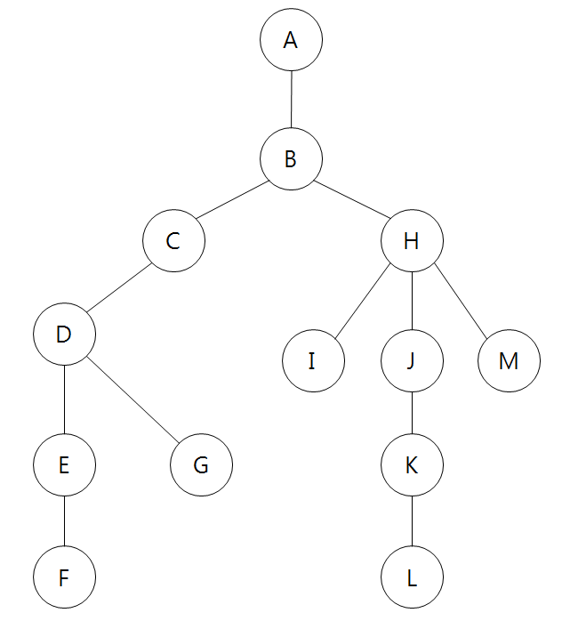

# Python으로 DFS, BFS 구현하기

코딩 테스트에서 자주 등장하는 유형 중 하나인 그래프 탐색 문제를 풀이하는데 필요한 DFS, BFS 탐색 방법을 Python으로 구현하는 방법을 기록한다.



위와 같은 그래프가 있을 때, 그래프의 모든 노드(Node)를 방문하는 방법은 두 가지이다.

- **BFS**: A - B - C - H - D - I - J - M - E - G - K - F - L
- **DFS**: A - B - C - D - E - F - G - H - I - J - K - L - M

위의 그래프를 Python의 `dict`, `list` 자료형을 이용해 구현하면 다음과 같다.
```
graph = {
    'A': ['B'],
    'B': ['A', 'C', 'H'],
    'C': ['B', 'D'],
    'D': ['C', 'E', 'G'],
    'E': ['D', 'F'],
    'F': ['E'],
    'G': ['D'],
    'H': ['B', 'I', 'J', 'M'],
    'I': ['H'],
    'J': ['H', 'K'],
    'K': ['J', 'L'],
    'L': ['K'],
    'M': ['H']
}
```

## BFS

BFS(Breadth-Fisrt-Search)는 그래프를 탐색할 때, **시작 노드(Node)에서 같은 거리에 있는 노드들을 먼저 순회**하며 탐색하는 방법이며, **항상 최단 거리를 찾을 수 있는 탐색 방법**이다.

BFS를 구현하기 위해서는 **자료구조 Queue를 사용**한다.

```
  1 def bfs(graph, start_node):
  2     visit = list()
  3     queue = list()
  4
  5     queue.append(start_node)
  6
  7     while queue:
  8         node = queue.pop(0)
  9         if node not in visit:
 10             visit.append(node)
 11             queue.extend(graph[node])
 12
 13     return visit
```

- Line 2 ~ 3: 방문한 노드와 방문할 노드를 저장할 배열(Queue)을 각각 선언한다.
- Line 5: 방문할 노드 Queue에 시작 노드를 추가한다.
- Line 7: Queue에 더 이상 방문할 수 있는 노드가 없을 때까지 반복한다.
- Line 8: Queue의 가장 앞에서 노드를 하나 꺼내온다.
- Line 9: 해당 노드가 아직 방문하지 않은 노드인 경우,
    - Line 10: 방문한 노드 배열에 추가한다. 
    - Line 11: 해당 노드의 자식 노드들을 방문할 노드 Queue에 추가한다.

## DFS

DFS(Depth-First-Search)는 그래프를 탐색 할 때, **시작 노드로부터 출발해 도달할 수 있는 가장 먼 노드까지 먼저 순회**한 후, Back-Tracking을 통해 아직 순회하지 못한 노드에 대해 동일한 방법으로 전체 그래프를 탐색하는 방법이다. BFS와 달리 **항상 최단 거리를 구하지는 못한다.**

DFS를 구현하기 위해서는 **자료구조 Stack을 사용**한다.

```
  1 def dfs(graph, start_node):
  2     visit = list()
  3     stack = list()
  4
  5     stack.append(start_node)
  6
  7     while stack:
  8         node = stack.pop()
  9         if node not in visit:
 10             visit.append(node)
 11             stack.extend(graph[node])
 12
 13     return visit
```

- Line 2 ~ 3: 마찬가지로 방문한 노드와 방문할 노드를 저장할 배열(but, Stack)을 각각 선언한다.
- Line 5: 방문할 노드 Stack에 시작 노드를 추가한다.
- Line 7: Stack에 더 이상 방문할 수 있는 노드가 없을 때까지 반복한다.
- Line 8: Stack의 가장 위에서 노드를 하나 꺼내온다.
- Line 9: 해당 노드가 아직 방문하지 않은 노드인 경우,
    - Line 10: 방문한 노드 배열에 추가한다. 
    - Line 11: 해당 노드의 자식 노드들을 방문할 노드 Stack에 추가한다.

