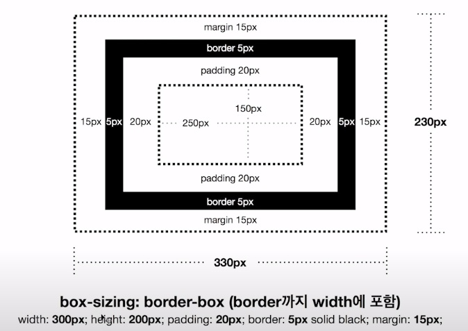

# CSS 기초 정리

## Block vs. Inline

Block은 자동으로 부모 태그를 꽉 채우게 되며, Inline은 일반 텍스트처럼 작동한다. **Block은 width, height 값을 설정해 크기를 변경할 수 있지만, Inline은 크기를 변경할 수 없다.**

따라서, Layout을 작성할 때 `
, <section>, <arttcle>`과 같은 기본 속성이 Block으로 설정되어 있는 태그를 사용하여 작성한다.

`, <a>` 태그와 같은 Inline 속성을 가지는 태그를 `display: inline-block` 설정을 통해 **width, height**를 통해 크기를 조절할 수 있도록 변경할 수도 있다. 

## CSS Box Model

CSS Layout을 구성하는 Display Block Elements에는 **Box Model**이라는 매커니즘이 적용된다.

#### `box-sizing` 속성의 값이 `content-box`일 때, 다음과 같이 작동한다. *기본값*
각 Element가 차지하는 영역의 크기는 width, height 뿐만 아니라 **padding, border, margin**의 값까지 더해진 크기이다. 즉, 특정 Element가 차지하는 **가로 영역의 크기**는 **width + padding + border + margin**의 값 만큼이다.

#### `box-sizing` 속성의 값이 `border-box`일 때, 다음과 같이 작동한다.
위의 경우와 다르게, **padding, border**의 값이 전체 **width**에 포함되게 된다. 따라서, Element가 차지하는 영역의 크기는 **width + margin**이 된다. 그림에서 확인할 수 있듯, width 값을 300으로 설정하였지만 여기서 **padding, border** 값이 제외되고 최종적인 width 값은 250이 된다.

Layout을 작성할 때, 각 Element가 차지하는 영역을 가늠하기 편리하여 많이 사용되지만 구형 브라우저 (IE 등)는 지원하지 않는다.