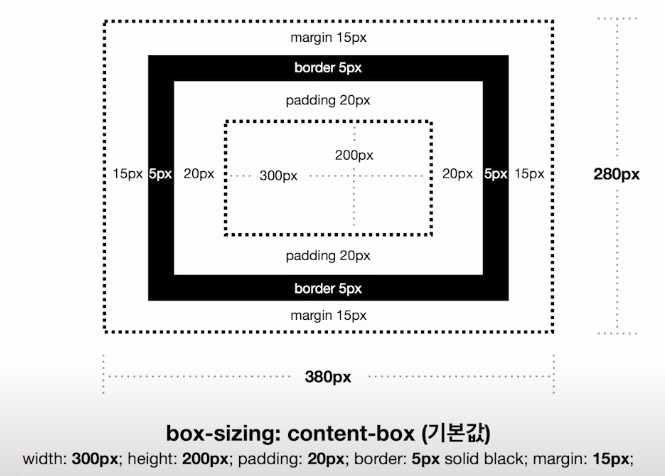

# CSS 기초 정리

## Block vs. Inline

Block은 자동으로 부모 태그를 꽉 채우게 되며, Inline은 일반 텍스트처럼 작동한다. **Block은 width, height 값을 설정해 크기를 변경할 수 있지만, Inline은 크기를 변경할 수 없다.**

따라서, Layout을 작성할 때 `
, <section>, <arttcle>`과 같은 기본 속성이 Block으로 설정되어 있는 태그를 사용하여 작성한다.

`, <a>` 태그와 같은 Inline 속성을 가지는 태그를 `display: inline-block` 설정을 통해 **width, height**를 통해 크기를 조절할 수 있도록 변경할 수도 있다. 

Block 속성의 태그에 `width: 100%; padding: 5%` 스타일을 부여하게 되면, **가로 길이가 총 110%가 되어** 가로축 스크롤이 생기는데, 이는 다음에 이어지는 **Box Model**과 관련된다.

## CSS Box Model

CSS Layout을 구성하는 Display Block Elements에는 **Box Model**이라는 매커니즘이 적용된다.

#### `box-sizing` 속성의 값이 `content-box`일 때, 다음과 같이 작동한다. *기본값*
각 Element가 차지하는 영역의 크기는 width, height 뿐만 아니라 **padding, border, margin**의 값까지 더해진 크기이다. 즉, 특정 Element가 차지하는 **가로 영역의 크기**는 **width + padding + border + margin**의 값 만큼이다.

#### `box-sizing` 속성의 값이 `border-box`일 때, 다음과 같이 작동한다.
위의 경우와 다르게, **padding, border**의 값이 전체 **width**에 포함되게 된다. 따라서, Element가 차지하는 영역의 크기는 **width + margin**이 된다. 그림에서 확인할 수 있듯, width 값을 300으로 설정하였지만 여기서 **padding, border** 값이 제외되고 최종적인 width 값은 250이 된다.

Layout을 작성할 때, 각 Element가 차지하는 영역을 가늠하기 편리하여 많이 사용되지만 구형 브라우저 (IE 등)는 지원하지 않는다.

## CSS Reset

`<h1>, 
`과 같은 태그는 기본적으로 일정한 CSS 스타링일이 적용되어 있는데, 이러한 요소가 디자이너의 요구에 따라 CSS Layout을 작성하는 과정에서 오히려 방해요소로 작용할 수 있다.

따라서, 각 태그에 적용된 기본 스타일을 제거하는 **CSS Reset**이 필요하다.

`* {
    margin: 0;
    padding: 0;
}`

예전에는 위와 같은 형태로 CSS Reset을 해주기도 했지만, 이러한 경우 HTML 문서에 있는 모든 태그에 접근해야 하므로 성능 상의 문제가 발생하여 요즘에는 잘 사용하지 않고 별도의 CSS Reset 코드를 사용한다.

## rem 이란?

HTML 문서의 Root 태그인 `<html>` 태그에 설정된 `font-size`를 말한다. 즉, `font-size: 1rem;`으로 설정하면 HTML 문서와 똑같은 크기의 글자 크기가 되고 `font-size: 2rem;`으로 설정하면 HTML 문서의 글자 크기보다 두 배 커진다.