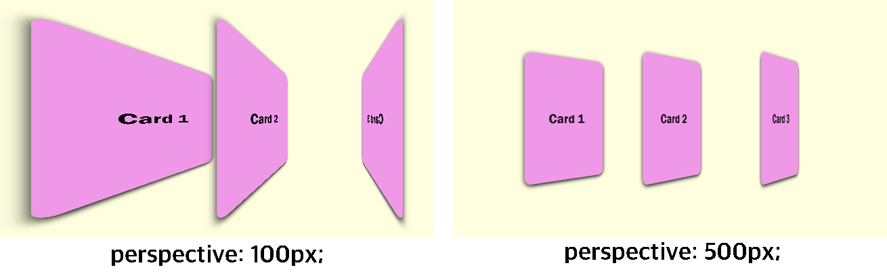

# CSS 3D

CSS `transform`에서 제공하는 `rotate`를 사용해 카드가 입체적으로 회전하는 효과를 구현하려고 한다.  
하지만 단순히 `transform: rotateY(45deg);` 속성만 적용하는 경우, **입체효과가 나타나지 않는다.**

이는 해당 Element를 감싸고 있는 Container가 2차원 평면 공간이기 때문이며,  
입체효과를 적용하고자 하는 요소를 감싸고 있는 **Container를 3차원 공간으로 설정**해 주어야 한다.

Container를 3차원 공간으로 설정하는 것은 간단히 `perspective: 450px;` 속성을 추가하면 되는데,  
여기서 `450px`은 **Container를 바라보고 있는 사람과의 거리** 정도로 생각하면 이해하기 쉽다.
즉, Container에서 멀리 떨어져 있을수록 입체효과가 미미하게 나타나고, 가까울수록 입체효과가 극적으로 나타난다. 



지금 위의 그림을 확인하면, 각각의 카드에 동일하게 `transform: rotateY(45deg);`를 적용했음에도 불구하고  
카드가 회전한 정도에 차이가 있는 것을 확인할 수 있다. 이는 Container에 `perspective: 450px;`를 적용하는 경우  
**사용자가 바라보는 위치에 따라 카드가 회전한 정도가 차이나는 것처럼 표시**하기 때문이다.

각각의 카드가 **균등하게 45도 회전한 것으로 표현**하고 싶다면, Container가 아닌 Element 각각에 대해  
`transform: perspective(500px) rotateY(45deg);`과 같이 설정하면 된다.


## 카드 앞, 뒷면 만들기

카드가 회전해도 현재 앞, 뒷면을 따로 그리고 있지 않기 때문에 글자가 뒤집혀 보이기만 한다.  
따라서, 아래와 같이 HTML 태그를 작성해 **앞, 뒷면을 별도로 그려주어야 한다.**

```
<div class="card">
    <div class="card-side card-side-front">Front</div>
    <div class="card-side card-side-back">Back</div>
</div>
```

```
.card {
    position: relative

    /* 생략 */

    transform: rotateY(0deg);
    transition: 1s;
    transform-style: preserve-3d;
}
.card-side {
    position: absolute;
    left: 0;
    top: 0;

    width: 100%;
    height: 100%;

    /* 생략 */

    backface-visibility: hidden;
}
.card-side-front {
    z-index: 1;
    background: white;
}
.card-side-back {
    transform: rotateY(180deg) ;
    background: rgba(233, 121, 233);
}
```

카드의 앞, 뒷면을 구성하는 두 개의 `<div>` 태그를 겹치기 위해서 `position: absolute;` 속성을 추가하고,  
이들을 감싸고 있는 부모 태그에 `position: relatvie;` 속성을 추가한다.  

`position` 속성의 기본값은 `static`으로, `absolute`를 적용하면 **기준점이 브라우저의 왼쪽 상단**이 된다.  
`absolute`의 **기준점을 부모로 설정하려면 부모의 `position` 속성값이 `static`이 아니어야 한다.**


## perspective 속성의 범위

현재 Container에 `perspective` 속성을 추가해 입체효과가 반영되도록 설정해 놓았지만,  
`perspective` 속성의 기본 범위는 바로 한 계층 아래의 자식들까지로 지정되어 있다.  
따라서, 자식의 자식 Element까지 입체효과를 반영하려면 `transform-style: preserve-3d;` 속성을 추가해야 한다.

마지막으로 카드의 앞, 뒷면 각각에 `backface-visibility: hidden;` 속성을 추가하여  
현재 뒤집혀 있어 사용자에게 보이지 않는 경우 화면에 그리지 않도록 설정해 주어야 한다.


## [보충] rem vs. em

CSS 속성의 값을 지정할 때 `px` 단위가 아닌, `rem` 또는 `em` 단위를 사용하기도 하는데,  
`rem`, `em`은 모두 **기준이 되는 어떠한 값을 지정된 배수로 변환해 표현**하는 크기이다.

- **`rem`**
    - 최상위 요소 - 보통은 `<html>` 태그 - 에서 지정된 font-size의 값을 기준으로 한다.
    - 예를 들어, `1rem`은 16px, `2rem`은 32px을 의미한다.
    - `<html>` 태그의 font-size 기본값은 16px이다.

- **`em`**
    - 현재 스타일 지정 요소의 font-size 값을 기준으로 한다.
    - 예를 들어, `font-size: 1.5rem;`이 적용된 요소에서 `1em`은 24px, `2em`은 48px이다.
