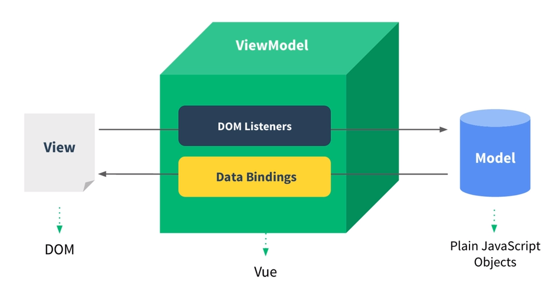

# 프론트엔드 기술 면접 (Project)

## 프레임워크, 라이브러리 관련 질문

### 1. SPA란?

말 그대로 **한 개의 페이지로 구성된 웹 어플리케이션**이다.

- 첫 페이지 요청 시, 필요한 모든 자원(HTML, CSS, JavaScript 등...)을 로딩한다.
    - 이후 필요한 데이터만 서버에 요청해 받아온 뒤, 화면을 동적으로 변경한다.

- SPA의 장점
    - **부드러운 사용자 경험**을 제공할 수 있다.
    - 필요한 자원만 부분적으로 로딩하여, 서버 부하를 줄일 수 있다.
    - 서버의 템플릿 연산을 클라이언트 측으로 분산한다.

- SPA의 단점
    - 모든 자원을 한 번에 받아오기 때문에, 초기 구동 속도가 느리다.
    - 웹 로봇에 의한 크롤링에 적합하지 않아, **검색 엔진 최적화**가 어렵다.

 

### 2. CSR과 SSR 차이?

화면이 생성되는 위치가 서버인지, 클라이언트인지 구분하는 용어이다.

- 클라이언트 사이드 렌더링(CSR)은 **화면을 사용자 측에서 생성**한다.
    - 빈 페이지가 사용자에게 제공되며, 브라우저 환경에서 화면을 생성한다.
    - URL 변경에 따라, 수정이 필요한 데이터만 서버에 요청한다.
    - 대부분의 SPA 개발은 CSR 방식을 따른다.

- 서버 사이드 렌더링(SSR)은 **화면을 서버 측에서 생성**한다.
    - 완전히 완성된 페이지가 사용자에게 제공된다.
    - 매번 URL에 해당하는 새로운 페이지를 렌더링 하여 제공해야 한다.
    - 검색 엔진 최적화에 강점을 가진다.

최근에는 SPA, CSR 단점을 개선하기 위한 SSR 프레임워크도 많이 사용되고 있는 추세이다.

 

### 3. Vue.js를 선택한 이유?

이미 Vue.js를 사용해 어플리케이션을 개발한 경험이 있는 친구에게 소개 받았다.

관련된 정보를 수집하며 React와 Angular를 알게 되었다. 당시에 발표된 SPA 프레임워크 순위표를 참고하여, Vue.js와 React가 가장 인기 있는 프레임워크라는 것을 알 수 있었다.

- React는 사용자가 가장 많았고, Vue.js는 Github 레포지토리 Star가 가장 많았다.
- 온라인 무료 강의를 통해 React, Vue.js의 기본적인 사용법을 경험해 보았다.
- Vue.js의 템플릿 방식이 React의 JSX 방식보다 사용하기 편리했다.
- HTML/CSS/JavaScript를 단일 파일로 통합해 관리하는 방식이 편리했다. 
- Vue.js는 후발 주자로서, **React와 Angular의 장점을 혼합**하여 만들어졌다.
    - 성장 가능성이 높은 프레임워크라고 판단했다.

 

### 4. Vue.js의 장/단점?

- Vue.js의 장점
    - 하나의 컴포넌트에 대한 HTML/CSS/JavaScript 코드를 단일 파일에서 관리할 수 있다. 
        - 컴포넌트 기반 개발에서 관심사는 컴포넌트이기 때문에, 가장 적합한 접근이다.
    - 자체적인 상태관리 라이브러리가 제공되어 쉽고 빠르게 학습할 수 있다.
        - Redux라는 외부 라이브러리를 사용해야 한다.
    - React, Angular에 비해 낮은 러닝 커브를 가진다.
    - 가장 최근에 발표되었고, 지속적인 메이저 버전이 업데이트 되어 성장 가능성이 크다.

- Vue.js의 단점
    - React에 비해 개발자 커뮤니티와 생태계가 협소하다.
    - React에 비해 직장을 구하기 어렵다.
    - 대규모 어플리케이션 개발에 적합하지 않다는 평가가 많다.

 

### 5. Vue.js 컴포넌트 생명주기

1. `beforeCreate`
    - Vue 인스턴스가 초기화 된 직후의 상태이다. 
    - 컴포넌트가 DOM에 추가되지 않았다.
    - `data`, `methods` 등에 접근할 수 없다.
2. `created`
    - 컴포넌트가 DOM에 추가되지 않았다.
    - `data`, `methods`, `computed`, `watch`에 접근할 수 있다.
    - Vue 인스턴스를 초기화하기 좋은 위치이다.
3. `beforeMount`
    - 컴포넌트가 DOM에 추가되기 직전 상태이다.
    - 가상 DOM이 생성된다.
4. `mounted`
    - 가상 DOM의 내용이 실제 DOM에 추가된다.
    - 가장 많이 사용되는 Hook이다.
5. `beforeUpdate`
    - `data` 값이 변해서, DOM에 수정이 필요한 상태이다.
    - 추가적인 렌더링을 유발하지 않는다.
6. `updated`
    - 가상 DOM의 내용이 변경되고, 실제 DOM에도 반영된다.
    - `data`를 조작하면 무한 루프를 발생시킬 수 있다.
7. `beforeDestroy`
    - Vue 인스턴스가 해체되기 직전의 상태이다.
    - 이벤트 리스터를 해제하기 좋은 위치이다.
8. `destroyed`
    - Vue 인스턴스가 해체되었다.
    - `data`, `methods` 등에 접근할 수 없다.

 

### 6. MVVM 패턴이란?

MVVM 패턴은 어플리케이션 로직과 사용자 인터페이스(UI)를 분리하기 위한 패턴이다.

Vue.js와 같은 SPA 프레임워크는 MVVM 패턴을 따르며, `Model`, `View`, `ViewModel`로 구성된다.

    

- Model
    - 순수 자바스크립트 객체를 의미한다.
- View
    - 웹 페이지의 DOM 구조를 의미한다.
- View Model
    - **Vue.js가 담당하고 있는 역할**이다.
    - DOM이 변경되면, `DOM Listener`를 통해 Model에 신호를 전달한다.
    - 모델이 변경되면, `데이터 바인딩`을 통해 View에 변경사항이 반영된다.

 

### 7. Virtual DOM이란?

브라우저의 렌더링 엔진은 HTML, CSS 문서를 파싱하여 **트리 구조의 DOM과 CSSOM을 생성**한다. DOM과 CSSOM을 결합하여 **렌더 트리를 생성**하고, 이를 기반으로 레이아웃을 계산해 최종적으로 화면을 렌더링한다.

- DOM API를 통해 DOM을 조작한 경우
- 브라우저 화면 크기를 변경해, `resize` 이벤트가 발생한 경우
- CSS 스타일 속성이 변경된 경우

위의 세 가지 경우 중 하나에 해당되면, 레이아웃을 다시 계산하는 **리플로우** 또는 화면을 다시 렌더링하는 **리페인팅** 과정이 수행되는데, 이것은 굉장히 **비용이 높은 작업**이다.

< 결론 >

화면에 변화가 발생할 때마다 실시간으로 DOM을 직접 수정하지 않고, 비교적 비용이 저렴한 Virtual DOM을 수정하며 모든 변경사항을 반영한다. 이후, Virtual DOM과 DOM을 비교하며 렌더 트리를 재구성하고, **단 한 번의 리플로우/리페인팅을 수행**한다.

즉, 불필요한 렌더링의 반복을 방지해 DOM의 부담을 줄일 수 있다.

 

### 6. Vuex란?

- Vuex는 Vue.js를 위한 상태관리 라이브러리이다.
    - Vue.js 어플리케이션의 **모든 컴포넌트에 대한 중앙 집중식 저장소**이다.

- Vuex의 구조
    - `state`
        - 어플리케이션의 상태를 나타낸다.
    - `mutations`
        - 어플리케이션의 상태를 변경한다.
        - `commit`로 호출한다.
    - `actions`
        - 비동기 요청을 수행한다.
        - `dispatch`로 호출한다.
    - `getters`
        - 어플리케이션 상태에 접근할 수 있다.

- 새로고침하면 `store`에 저장된 모든 데이터가 제거된다.

 

### 7. 상태관리란?

여러 컴포넌트 간의 데이터 전달과 이벤트 통신을 **하나의 장소에서 관리**하는 패턴이다.

- 상태관리의 장점
    - `props` 사용 시, 컴포넌트가 많아지면서 연결 구조가 복잡해지는 것을 해결한다.
    - `Event Bus` 사용 시, 컴포넌트 간 데이터의 흐름을 파악하기 어려운 것을 해결한다.

- Redux, Mobx와 같은 상태관리 라이브러리가 존재하며, Vue.js는 Vuex를 사용한다.

 

### 단방향 바인딩 / 양방향 바인딩?

- 단반양 바인딩
    - `v-bind`을 통해 이루어진다.
    - ViewModel에서 변경된 내용이 View에 반영된다.
        - 자바스크립트 데이터가 변경되면, 화면에 렌더링되는 결과가 변한다.
    - 화면에서 자바스크립트 데이터를 변경하는 것은 불가능하다.

- 양방향 바인딩
    - `v-model`을 통해 이루어진다.
    - View에서 변경된 내용이 ViewModel에 반영된다.
        - 화면에서 `<input>`등에 값을 입력하면, 자바스크립트 데이터가 변한다.
    - 화면에서 변경된 값이 실시간으로 자바스크립트 데이터에 반영된다.

 

### Axios 선택 이유?

- Vue.js 공식문서에서 권장하는 AJAX 통신 라이브러리다.
- Fetch와 달리, JSON을 기본적으로 역직렬화하여 제공한다.
    - Promise 체인을 하나 줄일 수 있다.
- Interceptor를 사용해, HTTP 요청/응답 직전에 캐치할 수 있다.
    - JWT 자동 인증에 사용했다.

 

### Axios vs Fetch API

- Axios 장/단점
    - HTTP Response를 자동으로 역직렬화하여, 객체로 제공한다.
    - `Node.js` 환경에서도 사용할 수 있다.
    - `Interceptor`를 사용해, HTTP 요청/응답을 중간에 캐치할 수 있다.
    - 외부 라이브러리라는 점에서, **보안 상 취약점**이 존재할 수 있다.
    - 별도의 **설치가 필요**하기 때문에, 배포 시 용량이 늘어난다.
    

- Fetch 장/단점
    - 브라우저에서 제공하는 **Web API**이다.
    - 별도의 설치가 필요하지 않으며, 배포 시 용량에 영향이 없다.
    - **브라우저 환경에서만 사용**할 수 있다.
    - 데이터를 바로 사용할 수 없고, `Response.json()`을 통해 역직렬화 해야한다. 

 

### Vuetify를 선택한 이유?

- `Bootstrap`은 가장 인기있는 선택지이지만, 특유의 디자인이 마음에 들지 않았다.
- Vue.js에 특화된 컴포넌트 기반의 UI 프레임워크이다.
- Vue.js 커뮤니티에 참고할 수 있는 자료가 많다.
- 한글로 번역된 공식 문서를 제공한다.

 

### Vuetify의 장/단점?

- 장점
    - Google의 Material UI를 기반으로 하여, 디자인 원칙을 쉽게 적용할 수 있다.
    - 완성된 컴포넌트를 제공하므로, 레이아웃을 빠르게 제작할 수 있다.
    - 기본적으로 제공되는 유려한 트랜지션을 사용할 수 있다.
        - 부드러운 사용자 경험을 제공할 수 있다.

- 단점
    - 이미 완성된 컴포넌트로 제공되어, 세부적인 내용을 수정하기 어렵다.
    - HTML 어트리뷰트 방식으로 CSS 스타일을 적용해, 규모가 커지면 관리가 어렵다.

 

### SCSS를 선택한 이유?

CSS는 비교적 간단한 문법 체계를 가지고 있어 배우고 사용하기 쉽지만, 어플리케이션의 규모가 커지면 복잡도가 급격히 증가하여, 코드를 관리하기 어려워진다.

특히 같은 내용을 반복적으로 작성해야 하고, 어플리케이션의 여러 위치에서 사용되는 CSS 속성 값을 변경하는 과정에서 실수가 발생하기도 쉽다.

- `Less`, `sass`, `SCSS`는 위와 같은 불편함을 해결하기 위한 **CSS 전처리기**다.
- CSS 코드를 효율적으로 작성하고 관리할 수 있도록 한다.
    - CSS 코드를 재활용할 수 있다.
    - CSS 계층 구조를 시각적으로 나타낼 수 있다.
- SCSS가 **CSS와 가장 유사한 형태로 코드를 작성**할 수 있다.
- SCSS가 **가장 큰 커뮤니티**를 가지고 있어, 참고할 수 있는 자료가 많다.

 

### BEM 방법론?

CSS 문서의 규모가 증가함에 따라, 클래스 이름을 추적하기 어려워지는 현상을 해결한다.

- Block
    - 재사용 가능한 독립적인 페이지 구성요소이다.
    - 주변 환경에 영향을 받지 않아야 한다.

- Element
    - 블록 내부에서 특정한 기능을 담당하는 구성요소이다.
    - 중첩해서 작성할 수 있다.

- Modifier
    - 블록과 요소의 모양이나 상태를 정의한다.

---

## 프로젝트 운영, 인성 관련 질문

### 팀 프로젝트 수행 시, 힘들었던 점은?

팀원마다 기대하는 목표가 다르고, 프로젝트에 임하는 자세에 온도차이가 존재한다.

- 팀원들 모두가 동의할 수 있는 목표를 설정하는 것이 중요하다.
- 그렇게 하면, 모두가 일정한 수준의 노력으로 프로젝트를 수행할 수 있다.

OOOO 프로젝트에서 팀장을 맡았을 때, 팀원의 능력과 관심사를 고려해 각자에게 적절한 목표와 과제를 부여하여, 좋은 결과를 도출해 낸 경험이 있다.

 

### 팀원과 갈등이 발생했을 때, 해결 방법은?

결국 사람 사이의 갈등을 해결하기 위해서는, **대화가 가장 중요**하다고 생각한다.

- 갈등이 발생한 이유를 알아야 한다.
- 상대방의 의견을 경청하고, 나의 의견을 정리해 전달할 수 있어야 한다.
- 사람마다 관심 분야가 다르고, 뛰어난 분야가 다르다는 것을 이해한다.
- "나의 의견이 무조건 옳다"라는 편협한 생각을 경계해야 한다.
- 타인의 의견을 수용할 수 있는 자세를 가지는 것이 중요하다.

 

### 문제 해결 능력?

문제를 해결하기 위해 가장 먼저 수행해할 것은, **문제를 정의하는 것**이다. 마주한 문제가 무엇인지 정확히 파악하지 못하면, 올바른 해결안을 도출하는 것이 불가능하다.

해결할 문제에 대한 이해가 완료되면, 다음과 같은 과정을 수행한다.

- 주어진 문제를 해결할 수 있는 방법을 2-3개 정도 찾아본다.
    - 하나의 문제를 해결하는데 단 하나의 방법만 존재하는 것은 아니기 때문이다.
- 각 방법을 적용했을 때 얻을 수 있는 장점과 단점을 확인한다.
    - 내가 사용하고자 하는 방법에 대한 이해가 필요하기 때문이다.
    - 어떻게 문제를 해결할 수 있고, 그 방법을 이용할 때 발생하는 부수효과는?
- 현재의 문제를 해결하는데 가장 적합한 방법을 선택한다.
    - 장점과 단점을 기반으로 현재의 문제에 가장 적절한 대안을 선택해야 한다.

예를 들어, 인턴으로 근무했던 회사에서 비상태성 특징을 가지는 HTTP 프로토콜을 기반의 **실시간 푸시 알람**을 구현해야 하는 문제가 있었다.

- Long-Polling, Server Sent Event, WebSocket 기술을 선정했다.
- 각 기술의 장점과 단점을 생각해보고, 동작 원리를 공부했다.
- 양방향 통신이 필요하지 않기 때문에, WebSocket 대신 SSE를 선택했다.

 

### 가장 기억에 남는 프로젝트는 무엇이고, 그 이유는?

 

### 평소 공부는 어떻게 진행하는지?

기본적으로는 프로젝트를 진행하며 직접 부딪혀보며 공부하는 방법을 선호한다. 이론만 공부하고 실제로 사용해보지 않으면, 그 기술을 온전히 나의 것으로 만들 수 없다.

- 컴퓨터 과학, 프로그래밍 언어 등
    - 기초적인 지식은 오랜 시간동안 연구되어 왔고, 빠르게 변하지 않는다.
    - 관련 내용을 깊게 다루는 서적이 시중에 많이 나와있다.
    - 그러므로 서적을 통해 공부하는 것이 좋다고 생각한다.

- 프레임워크, 라이브러리 등
    - 새로운 기술이 빠르게 등장하고 변화하는 특징이 있다.
    - 서적의 경우 내용은 좋지만, 기술의 발전 속도를 따라가지 못하는 경우가 많다.
        - 매번 내용을 수정해 개정판을 내는 것은 불가능하기 때문이다.
    - 따라서, 프레임워크와 라이브러리는 온라인 강의나 기술 블로그를 통해 공부한다.

추가적으로, 꼬리에 꼬리를 무는 방식으로 공부하는 것을 좋아한다. 어떤 기술을 배워서 사용하다가 그 기술의 한계가 발견되었을 때, 이를 보완할 수 있는 기술을 탐색하고 공부하는 편이다.

 

### 성격의 장/단점?

- 장점
    - 감정에 크게 동요되지 않고, 차분함을 유지하는 편이다.
        - 오랜 기간 꾸준히 진행해야 하는 일에서 강점으로 작용할 수 있다.
    - 낯선 사람과 대화에 불편함을 느끼지 않는다.
        - 협업 과정에서 다양한 사람과 의사소통할 수 있는 강점이 있다.
    - 말하는 것보다 상대방의 말을 듣는 것을 선호한다.
        - 역시 협업 과정에서 상대방의 의견을 수용하는 자세는 강점이 된다.

- 단점
    - 일을 벌리는 것을 좋아하지만, 체계적으로 관리하지 못한다.
        - 일정 관리 어플리케이션을 이용해 일정을 기록하고 관리하려고 노력한다.
    - 사소한 문제에 지나치게 많은 시간을 투자하기도 한다.
        - 문제 해결에 소비할 시간을 정해두는 편이다.
    
 

### 앞으로 어떤 개발자로 성장하고 싶은지?

탄탄한 기본기와 앞으로 쌓을 경험을 기반으로, 많은 사람들이 사용하고 있는 오픈소스 라이브러리에 기여하여 웹 개발 생태계를 가꿔나가고 싶다.

아직 그럴듯한 오픈소스 기여 경험은 없지만, Express 서버를 작성하기 위해 문서를 읽다가 오탈자를 발견해 PR을 보낸적이 있었다. 최종적으로 PR이 승인되었을 때, 알수 없는 뿌듯함을 느낀 경험이 있다.

단순히 정해진 기능을 수행하는 어플리케이션보다, 사용자에게 보다 나은 경험을 제공할 수 있는 어플리케이션을 만드는 사람이 되고싶다.

서비스가 제공하는 가치가 사용자에게 온전히 전달되기 위해서는, 부드러운 사용자 경험이 필수적이라고 생각하기 때문이다. 

 

### 마지막 질문?

JWT 토큰을 어디에 저장하는 것이 옳은가?

- JWT의 보안 이슈 해결을 위해 `Access Token`과 `Refresh Token`을 사용한다.
- Google에서 검색해보면, 이러한 토큰을 "안전한 위치에 저장한다"고 되어있다.
- LocalStorage, SessionStorage도 결국은 클라이언트 사이드기 때문에 안전하지 않다.
- 그렇다면 서버에 저장하는 것이 가장 안전한데, 이것은 서버에 부하를 발생시킨다.

JWT 토큰을 어디에 저장하고, 관리하고 계신지 의견을 여쭙고 싶다.
