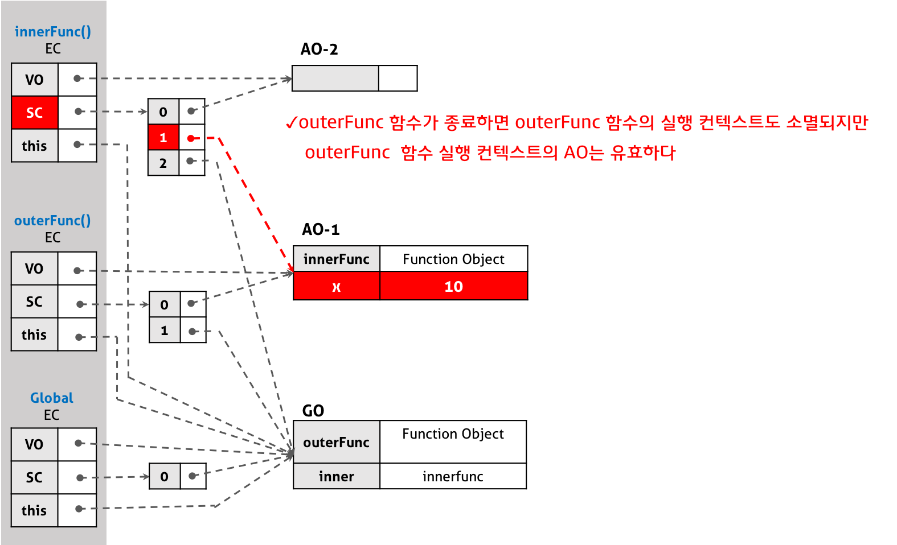

# 클로저 (_Closure_)

## 클로저란?

클로저는 Javascript의 중요한 개념 중 하나로, 제대로 이해하기 위해서는 앞서 공부한 실행 컨텍스트(_Execution Context_)에 대한 지식이 필요하다.

다만 클로저는 Javascript에만 존재하는 고유한 개념은 아니며, 함수를 **일급 객체(_First-class Ojbect_)로 취급하는 함수형 프로그래밍 언어에서 사용되는 개념**이다.

> 클로저는 함수와 그 함수가 선언됐을 때의 렉시컬 환경(_Lexical environment_)과의 조합이다.

클로저에 대해 MDN은 위와 같이 정의하고 있다. 여기서 중요한 단어는 **함수가 선언됐을 때의 렉시컬 환경**이다.

```javascript
function outer() {
  var outerVar = 10;
  var inner = function () {
    console.log(outerVar);
  };
  inner();
}

outer(); // 10
```

함수 `outer` 내부에서 또 다른 함수 `inner`가 선언되었고, 이런 함수를 **내부 함수**라고 한다. 이때 내부 함수 `inner`는 **자신을 포함하고 있는 외부 함수 `outer`가 가지고 있는 변수 `outerVar`에 접근 가능**하다.

> Javascript에서 스코프는 함수를 호출할 때가 아닌, 함수가 선언될 때 결정된다. 이러한 스코프 결정 방식을 **렉시컬 스코핑 방식**이라고 한다.
>
> 위 예제에서 함수 `inner`는 함수 `outer` 내부에서 선언되었으므로, 함수 `inner`의 상위 스코프는 함수 `outer`의 스코프이다.

함수 `inner`가 함수 `outer`의 내부에 선언된 내부 함수이므로, **함수 `inner`는 자신이 속한 렉시컬 스코프(= 전역 스코프, `outer`의 스코프, 자기자신의 스코프)를 참조**할 수 있다.

<br>

### 실행 컨텍스트의 관점에서...

내부 함수 `inner`가 호출되면, 자기자신의 실행 컨텍스트가 스택(_Stack_)에 추가되고 변수 객체, 스코프 체인, 그리고 `this`에 바인딩 되는 객체가 결정된다.

이때 `inner` 함수 실행 컨텍스트의 스코프 체인은 다음의 세 가지를 순차적으로 참조한다.

1. 자기자신 `inner`의 스코프를 가리키는 활성 객체
2. 함수 `outer`의 스코프를 가리키는 활성 객체
3. 전역 스코프를 가리키는 전역 객체

이 **스코프 체인이 참조하는 객체들이 바로 렉시컬 스코프의 실체**이다.

내부 함수 `inner`가 자신을 포함하는 외부 함수 `outer`의 변수 `outerVar`에 접근할 수 있는 것, 즉 상위 스코프에 접근할 수 있는 것은 렉시컬 스코프의 참조를 순차적으로 저장하고 있는 실행 컨텍스트의 스코프 체인을 *Javascript Engine*이 검색하기 때문에 가능하다.

1. 함수 `inner`의 스코프 내부에서 변수 `outerVar`를 검색하지만, 찾지 못한다.
2. `inner`의 외부 함수 `outer`의 스코프에서 변수 `outerVar`를 검색하며, 성공한다.

<br>

### `inner()`를 `outer()`에서 호출하는 대신, 반환하도록 한다면?

```javascript
function outer() {
  var outerVar = 10;
  var inner = function () {
    console.log(outerVar);
  };
  return inner;
}

var closure = outer();
closure(); // 10
```

함수 `outer`는 내부 함수 `inner`를 반환하고 생을 마감하며, 외부 함수 `outer`의 **실행이 종료되었으므로 실행 컨텍스트 스택에서 제거**된다.

따라서 함수 `outer`의 변수 `outerVar`에도 더 이상 접근할 수 없을 것 같지만, 실제로는 위의 예시와 같이 `closure()`를 호출하면 변수 `outerVar`의 값이 출력된다.

이와 같이 자신을 포함하고 있는 외부 함수보다 내부 함수가 더 오래 유지되는 경우, 외부 함수 밖에서 내부 함수가 호출되더라도 외부 함수의 지역 변수에 접근할 수 있는 함수를 **클로저**라고 부른다.

<br>

### 다시 MDN의 정의로 돌아와서...

> 클로저는 함수와 그 함수가 선언됐을 때의 렉시컬 환경(_Lexical environment_)과의 조합이다.

위 정의에서 말하는 "함수"란 반환된 **내부 함수 `inner`** 자체를 의미하며, "그 함수가 선언됐을 때의 렉시컬 환경"은 **내부 함수 `inner`가 선언된 당시의 스코프**를 의미한다.

즉, 클로저는 반환된 내부 함수가 자신이 선언되던 당시의 환경(_Lexical Environment_)인 스코프를 기억하여 자신이 선언되던 당시의 환경(= 스코프) 밖에서 호출되어도 해당 환경에 접근할 수 있는 함수를 말하는 것이다.

이를 조금 더 간단히 말하면 클로저는 자신이 생성된 환경을 기억하는 함수라고 말할 수 있다.

클로저에 의해 참조되는 외부 함수의 변수, 즉 `outerFunc()` 함수의 변수인 `outerVar`를 **자유 변수**라고 부른다.

<br>

### 다시 실행 컨텍스트의 관점에서 해석하면...

내부 함수가 유효한 상태에서 외부 함수가 먼저 종료되어 외부 함수의 실행 컨텍스트가 반환되어도, 외부 함수 실행 컨텍스트 내의 활성 객체(_Activation object_)는 내부 함수에 의해 참조되는 한 유효하여 **내부 함수가 스코프 체인을 통해 참조할 수 있는 것**이다.

즉 외부 함수가 이미 반환되었어도 외부 함수 내의 변수는 이를 필요로 하는 내부 함수가 하나 이상 존재하는 경우 계속 유지된다. 이때 내부 함수가 외부 함수에 있는 변수의 복사본이 아니라 실제 변수에 직접 접근한다.



<br>

## 클로저의 활용

클로저는 자신이 생성될 때의 환경(Lexical environment)을 기억해야 하므로 **메모리 차원에서 손해**를 볼 수 있다.

하지만 클로저는 Javascript의 강력한 기능으로 이를 적극적으로 사용해야 한다. 클로저가 유용하게 사용되는 상황에 대해 살펴보자.

<br>

### 상태 유지

클로저가 가장 유용하게 사용되는 상황은 **현재 상태를 기억하고 변경된 최신 상태를 유지**해야 하는 상황이다.

```javascript
var box = document.querySelector(".box");
var toggleBtn = document.querySelector(".toggle");

/* [1] 즉시 실행 함수 선언 */
var toggle = (function () {
  var isShow = false;

  // [2] 클로저 반환
  return function () {
    box.style.display = isShow ? "block" : "none";
    // [4] 상태 변경
    isShow = !isShow;
  };
})();

// [3] DOM의 이벤트 속성에 클로저 할당
toggleBtn.onclick = toggle;
```

1. `toggle` 전역 변수에 *즉시 실행 함수*를 이용해 **익명 함수 형태의 클로저를 반환**한다.

2. 반환된 클로저는 **자신이 생성된 렉시컬 환경에 속한 변수 `isShow`를 기억**한다.

3. 클로저를 변수 `toggleBtn`에 저장한 *DOM*의 `onClick` 이벤트에 대한 이벤트 핸들러로 등록한다.

   - 이벤트 핸들러를 제거하지 않는 이상, 클로저가 기억하는 변수 `isShow`는 소멸되지 않는다.

4. 버튼을 클릭하면 `onClick` 이벤트에 등록한 핸들러인 클로저가 실행된다.

   - 클로저에 의해 `box` 변수에 저장한 DOM의 표시 여부가 변수 `isShow`의 값에 의해 결정된다.
   - 변수 `isShow`는 클로저에 의해 참조되고 있으므로, 최신 상태로 유지된다.

이와 같이 클로저는 현재의 상태(= `isShow`)를 기억하고, 상태가 변경된 후에도 그 최신의 상태를 유지해야 하는 상황에서 유용하게 사용될 수 있다.

만약 클로저가 없었다면 전역 변수를 사용해야 하는데, 전역 변수는 쉽게 오염될 수 있다는 점에서 최대한 사용을 자제해야 한다.

<br>

### 전역 변수의 사용 억제

숫자를 세는 카운터를 구현하고자 할 때, 누적된 숫자를 저장하기 위해 전역변수를 사용할 수도 있다.

하지만 전역변수는 다른 개발자에 의해 재선언 되거나, 다른 모듈에서 같은 이름의 변수가 존재하면 충돌이 발생하는 등 많은 문제의 원인이 되기 쉽다.

그렇다고 지역변수를 사용하면, 함수가 호출될 때마다 지역변수가 `0`으로 초기화되기 때문에 정상적으로 숫자를 세는 기능을 구현할 수 없다. 즉, 변경된 상태를 유지하지 못한다.

```javascript
var incleaseBtn = document.getElementById("inclease");
var count = document.getElementById("count");

// 즉시 실행 함수 선언
var increase = (function () {
  // 카운트 상태를 유지하기 위한 자유 변수
  var counter = 0;
  // 클로저를 반환
  return function () {
    return ++counter;
  };
})();

incleaseBtn.onclick = function () {
  count.innerHTML = increase();
};
```

위의 코드는 클로저를 이용해 숫자를 세는 카운터를 구현한 것이며, 다음과 같이 동작한다.

1. 즉시 실행 함수(_IIFE, Immediately-Invoked Function Expression_)가 실행된다.

2. 변수 `increase`에 반환된 함수 `function() { return ++counter; }`가 할당된다.

3. 위 함수는 자신이 생성된 렉시컬 환경을 기억하는 **클로저**이다.

4. 즉시 실행 함수는 클로저를 반환하고 종료되며, 실행 컨텍스트 스택에서 제거된다.

5. 클로저는 `increaseBtn`의 이벤트 핸들러에 포함되어 버튼이 클릭될 때마다 호출된다.

6. 클로저는 자신을 생성된 즉시 실행 함수에 속한 지역변수 `counter`를 기억한다.

7. 클로저가 호출될 때마다 변수 `counter`의 값이 증가하며, 변화한 상태를 유지한다.

즉시 실행 함수는 단 한번만 실행된 뒤 접근할 수 없으므로, `increase()`가 호출되더라도 지역변수 `counter`의 값이 초기화되지 않는다.

Javascript에는 `public`, `private`과 같은 접근제어자가 없지만, 클로저가 기억하는 즉시 실행 함수의 지역변수 `counter`는 외부에서 접근할 수 없으므로 `private`하다.

따라서 `counter` 변수는 **외부에서 값을 변경할 수 없어, 전역변수에 비해 오염에 안전**하다.

<br>

### 정보의 은닉

```javascript
function Counter() {
  // 카운트를 유지하기 위한 자유 변수, 외부에서 접근 불가
  var counter = 0;

  // 클로저
  this.increase = function () {
    return ++counter;
  };

  // 클로저
  this.decrease = function () {
    return --counter;
  };
}

const counter = new Counter();

console.log(counter); // Counter { increase: f(), decrease: f() }
console.log(counter.counter); // undefined
console.log(counter.increase()); // 1
console.log(counter.decrease()); // 0
```

`Counter`와 같은 생성자 함수를 선언하고, `new` 키워드를 사용해 호출하면 새로운 객체(= _인스턴스_)를 생성해 반환한다.

새롭게 생성된 인스턴스는 자신이 생성된 렉시컬 환경을 기억하는 메서드 `increaser`와 `decrease`를 가지며, 이 메서드들은 **생성자 함수 `Counter`의 스코프에 속하는 변수 `counter`의 값을 기억하는 클로저**이다.

즉, 생성자 함수가 생성한 **인스턴스의 메서드**는 해당 인스턴스의 속성(_Property_)에만 접근할 수 있는 것이 아니며 **자신이 기억하는 렉시컬 환경의 변수에도 접근**할 수 있다.

<br>

#### 생성자 함수의 지역변수 vs. `this`에 바인딩된 속성

이때 생성자 함수 `Counter`의 지역변수 `counter`는 `this`에 바인딩된 속성이 아니라는 것이 중요하다.

`counter`가 `this.counter = 0`과 같이 선언하여 `this`에 바인딩된 속성이라면, 생성자 함수가 생성한 인스턴스를 통해 외부에서 접근이 가능한 `public` 속성이 되었을 것이다.

`var counter = 0`과 같이 생성자 함수의 지역변수로 선언되었기 때문에, 함수 레벨 스코프 외부에서는 접근할 수 없다. 즉, `private` 속성이 된 것이다.

하지만 생성자 함수 `Counter`가 생성한 인스턴스의 메소드인 `increase`, `decrease`는 클로저이기 때문에 자신이 생성됐을 때의 렉시컬 환경인 생성자 함수 `Counter`의 변수 `counter`에 접근할 수 있다.

이러한 클로저의 특징을 사용해 클래스 기반 언어의 `private` 키워드를 흉내낼 수 있다.

<br>

## 자주 발생하는 실수

아래의 예제는 클로저를 사용할 때 자주 발생할 수 있는 실수에 관련한 예제이다.

```javascript
var arr = [];

// [1] arr[i]에 i의 값을 반환(0 1 2 3 4)하는 함수를 할당 (의도)
for (var i = 0; i < 5; i++) {
  arr[i] = function () {
    return i;
  };
}

// [2] 배열 arr을 순회하며, 각 원소에 할당된 함수를 호출
for (var j = 0; j < arr.length; j++) {
  console.log(arr[j]()); // 5 5 5 5 5 (실제)
}
```

배열 `arr`에 **반복문의 현재 `i` 값을 반환하는 5개의 함수**를 할당하여, 순차적으로 호출할 경우 `0 1 2 3 4`가 출력되도록 하고자 하였다.

하지만 실제 실행결과는 `5 5 5 5 5`인데, 이것은 `for`문에서 사용한 변수 `i`가 전역변수이기 때문이다.

또한 `var` 키워드를 사용하면 *함수 레벨 스코프*를 따르며, 변수 `i`를 반환하는 함수 `function() { return i; }`의 상위 스코프는 전역 스코프가 되기 때문이기도 하다.

```javascript
var arr = [];

for (var i = 0; i < 5; i++) {
  // [1] 즉시실행 함수를 할당한다.
  arr[i] = (function (id) {
    // [2] 전달받은 변수 i를 id에 할당 후, 내부 함수를 반환한다.
    return function () {
      return id; // [2] id는 자유변수가 된다.
    };
  })(i);
}

// [3] 자유변수의 값은 유지된다.
for (var j = 0; j < arr.length; j++) {
  console.log(arr[j]()); // 0 1 2 3 4
}
```

앞의 문제를 클로저를 이용해 해결한 예시 코드이다.

1. 배열 `arr`에 즐시 실행 함수가 반환하는 함수를 할당한다.

2. 즉시 실행 함수는 변수 `i`를 전달 받고, 매개변수 `id`에 할당한 뒤 내부 함수를 반환한다.

   - 이때, 매개변수 `id`는 **자유변수**가 된다.

3. 배열 `arr`에 할당된 함수는 `id`를 반환한다. 이때 `id`는 상위 스코프의 자유변수이므로 값이 유지된다.

```javascript
const arr = [];

for (let i = 0; i < 5; i++) {
  arr[i] = function () {
    return i;
  };
}

for (let i = 0; i < arr.length; i++) {
  console.log(arr[i]()); // 0 1 2 3 4
}
```

*블록 레벨 스코프*를 따르는 ES6의 `let` 키워드를 사용하면, 클로저를 사용하지 않아도 문제를 해결할 수 있다.
