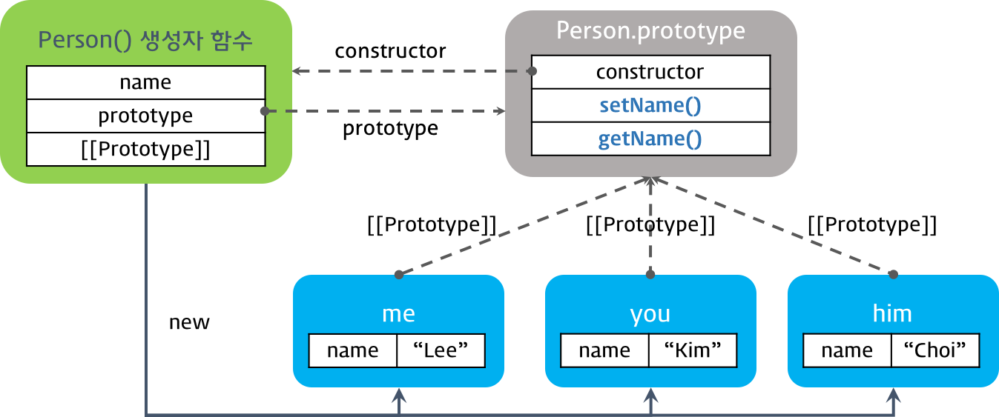

# 객체지향 프로그래밍

## 객체지향 프로그래밍이란?

객체지향 프로그래밍(_Object-Oriented Programming, OOP_)은 프로그래밍 패러다임 중 하나이다. 객체지향 프로그래밍은 컴퓨터 프로그램을 명령어의 목록으로 보는 시각에서 벗어나 **여러 개의 독립된 단위, 즉 객체들의 모임으로 파악**하고자 하는 것이다.

> 패러다임(_Pradigm_)이란, 어떤 한 시대 사람들의 견해나 사고를 근본적으로 규정하고 있는 테두리로서의 인식의 체계, 또는 사물에 대한 이론적인 틀이나 체계를 의미하는 개념이다.

객체지향 프로그래밍은 실세계에 존재하는 객체(_Object_)를 소프트웨어 세계에서 표현하기 위해 객체의 핵심적인 개념 똔느 기능만을 추출하는 추상화(_Abstraction_)를 통해 모델링한다. 간단히 말해서 인간이 실세계에서 사물을 인지하는 방식을 프로그래밍 과정에 접목하려는 것이다.

각 객체는 메세지를 주고 받거나, 데이터를 처리하는 등 **독립적인 역할을 수행**한다.

<br>

## 클래스 기반 vs. 프로토타입 기반

객체지향 프로그래밍은 크게 *클래스 기반 객체지향 프로그래밍*과 *프로토타입 기반 객체지향 프로그래밍*으로 구분된다. Javascript는 앞에서 공부한 것과 같이, **프로토타입 기반의 객체지향 언어**이다.

또한 Javascript는 하나 이상의 프로그래밍 패러다임을 지원하는 **다중 패러다임 언어**이기도 하며, *함수형(Functional), 명령형(Imperative) 프로그래밍*을 지원한다.

<br>

### 프로토타입 기반 객체지향 프로그래밍

Javascript는 클래스 개념이 없으며, 다음과 같은 세 가지 방법으로 객체를 생성한다.

- 객체 리터럴
- Obejct 생성자 함수
- 생성자 함수

```javascript
// [1] 객체 리터럴
var personA = {};
personA.name = "Lee";

// [2] Object() 생성자 함수
var personB = new Object();
personB.name = "Lee";

// [3] 생성자 함수
function Person() {}
var personC = new Person();
personC.name = "Lee";
```

Javascript는 이미 **생성된 인스턴스의 자료구조와 기능을 동적으로 변경할 수 있다**는 특징이 있다.

객체 지향 프로그래밍의 대표적인 개념인 **상속, 캡슐화(_정보 은닉_) 등은 프로토타입 체인과 클로저 등으로 구현**할 수 있다.

> ES6에서 새롭게 `class` 키워드가 추가되어 Javascript에서도 클래스 기반 언어에서와 같이 클래스를 생성할 수 있게 되었다. 그러나 Javascript의 동작 방식 자체가 변경된 것은 아니며, 기존의 프로토타입 기반 방식을 사용하기 쉽도록 변경한 *Syntactic Sugar*이다.

<br>

## 생성자 함수와 인스턴스의 생성

Javascript는 생성자 함수와 `new` 키워드를 이용해 인스턴스를 생성할 수 있다. 이때 생성자 함수는 클래스이자 생성자의 역할을 수행한다.

```javascript
// 생성자 함수(Constructor)
function Person(name) {
  this.name = name; // 프로퍼티(= 속성)

  // 메서드
  this.setName = function (name) {
    this.name = name;
  };

  // 메서드
  this.getName = function () {
    return this.name;
  };
}

var personA = new Person("Lee"); // 인스턴스 생성
console.log(personA.getName()); // Lee

personA.setName("Kim"); // 메서드 호출
console.log(personA.getName()); // Kim
```

위의 예시 코드는 정상적으로 작동하지만, 추후 문제가 될 수 있는 요소를 내포하고 있다.

다음과 같이 `Person` 생성자 함수를 여러 번 호출하여 여러개의 인스턴스를 생성할 때 문제가 발생한다.

```javascript
var me = new Person("Kim");
var him = new Person("Choi");
var her = new Person("Lee");

console.log(me); // Person { name: "Kim:, setName: [Function], getName: [Function]}
console.log(him); // Person { name: "Choi:, setName: [Function], getName: [Function]}
console.log(her); // Person { name: "Lee:, setName: [Function], getName: [Function]}
```

`console.log()`를 호출해 인스턴스의 내용을 출력해보면, 각각의 **인스턴스에 `setName`, `getName` 메서드가 중복되어 생성**된 것을 확인할 수 있다.

위와 같은 상황은 프로그램이 소규모인 경우 문제가 되지 않지만, 중규모 이상의 프로그램에서는 성능상 문제로 이어질 수 있다.

이상적인 구조는 각각의 인스턴스가 별도의 프로퍼티(= 속성)를 가지되, 중복되는 메서드의 경우 **메서드에 대한 참조만을 가지도록 하는 것**이다.

이같은 문제를 해결하려면 **프로토타입을 사용**해야 한다.

<br>

## 프로토타입 체인과 메서드 정의

모든 객체는 **프로토타입**이라고 불리는, 자신의 부모 역할을 하는 객체를 가리키는 내부 링크 `[[Prototype]]`을 가지고 있다. 즉, 프로토타입을 통해 직접 객체를 연결할 수 있는데 이를 **프로토타입 체인**이라고 한다.

프로토타입을 이용해 생성자 함수 내부의 메서드를 생성자 함수의 `prototype` 속성이 가리키는 프로토타입 객체(= `Person.prototype`)로 이동시키면, 생성자 함수에 의해 생성된 모든 인스턴스(= `me`, `him`, `her`)는 프로토타입 체인을 통해 프로토타입 객체의 메서드(= `setName`, `getName`)에 접근할 수 있게 된다.

```javascript
function Person(name) {
  this.name = name;
}

// 프로토타입 객체에 메서드 정의
Person.prototype.setName = function (name) {
  this.name = name;
};

// 프로토타입 객체에 메서드 정의
Person.prototype.getName = function () {
  return this.name;
};

var me = new Person("Lee");
var you = new Person("Kim");
var him = new Person("choi");

console.log(Person.prototype); // Person { setName: [Function], getName: [Function] }

console.log(me); // Person { name: 'Lee' }
console.log(you); // Person { name: 'Kim' }
console.log(him); // Person { name: 'choi' }
```



`Person` 생성자 함수의 `prototype` 속성이 가리키는 프로토타입 객체로 이동시킨 `setName`과 `getName` 메서드는 프로토타입 체인에 의해 모든 인스턴스에서 접근할 수 있게 된다.

프로토타입 객체(= `Person.prototyoe`)는 인스턴스들이 상속할 것들이 저장되는 장소이다.

> Javascript는 특정 객체의 속성/메서드에 접근하려고 할 때, 객체 내부에 해당하는 속성/메서드가 존재하지 않으면 [[Prototype]]이 가리키는 링크를 따라 **대상 객체의 부모 역할을 하는 프로토타입 객체의 속성/메서드를 차례대로 탐색**한다. 이것을 프로토타입 체인이라고 한다.

<br>

## 상속 (_Inheritance_)

Java와 같은 클래스 기반 언어에서 상속은 코드의 재사용성을 극대화한다는 점에서 유용하다. `extends` 키워드를 사용해 이미 존재하는 클래스를 손쉽게 확장할 수 있다.

Javascript에서는 기본적으로 프로토타입을 통해 상속을 구현하는데, 이것은 프로토타입을 통해 **객체가 다른 객체로 직접 상속**된다는 의미이다. 이러한 점은 Javascript의 약점으로 여겨지기도 하지만, 프로토타입을 통한 상속은 클래스 기반보다 강력한 방법이다.

Javascript의 상속 구현 방식은 크게 두 가지로 구분된다.

- **의사 클래스 패턴 상속**
  - Java, C++과 같은 클래스 기반 언어의 상속 방식을 흉내내는 것이다.
- **프로토타입 패턴 상속**
  - 프로토타입을 이용해 상속을 구현하는 것이다.

<br>

### 의사 클래스 패턴 상속

의사 클래스 패턴(_Pseudo-Class Pattern_)은 **자식 생성자 함수의 `prototype` 속성을 부모 생성자 함수의 인스턴스로 교체**하여 상속을 구현하는 방법이다.

부모와 자식 모두 생성자 함수를 정의하여야 한다.

```javascript
// 부모 생성자 함수
var Parent = (function () {
  // Constructor
  function Parent(name) {
    this.name = name;
  }

  // method
  Parent.prototype.sayHi = function () {
    console.log("Hi! " + this.name);
  };

  return Parent; // Constructor 반환
})();

// 자식 생성자 함수
var Child = (function () {
  // Constructor
  function Child(name) {
    this.name = name;
  }

  // 자식 생성자 함수의 프로토타입 객체를 부모 생성자 함수의 인스턴스로 교체.
  Child.prototype = new Parent(); // [2]

  // 메서드 오버라이드
  Child.prototype.sayHi = function () {
    console.log("안녕하세요! " + this.name);
  };

  // sayBye 메서드는 Parent 생성자 함수의 인스턴스의 속성으로 추가된다.
  Child.prototype.sayBye = function () {
    console.log("안녕히가세요! " + this.name);
  };

  return Child; // Constructor 반환
})();

var child = new Child("child"); // [1]
console.log(child); // Parent { name: 'child' }

console.log(Child.prototype); // Parent { name: undefined, sayHi: [Function], sayBye: [Function] }

child.sayHi(); // 안녕하세요! child
child.sayBye(); // 안녕히가세요! child

console.log(child instanceof Parent); // true
console.log(child instanceof Child); // true
```

`Child` 생성자 함수가 [1]에서 생성한 인스턴스 `child`의 프로토타입 객체(= `child.__proto__`)는 `Parent` 생성자 함수가 [2]에서 생성한 인스턴스이다.

그리고 `Parent` 생성자 함수가 [2]에서 생성한 인스턴스의 프로토타입 객체는 `Parent.prototype`이다.

이로써 `child`는 프로토타입 체인에 의해 `Parent` 생성자 함수가 생성한 인스턴스와 `Parent.prototype`의 모든 속성/메서드에 접근할 수 있게 되었다.

그림으로 나타내면 다음과 같다.


마찬가지로 정상적으로 작동하지만, 몇가지 문제를 가지고 있다.

1. `new` 키워드로 인스턴스를 생성
   - Javascript의 프로토타입 본질에 모순된다.
   - `new` 키워드를 실수로 포함하지 않는 경우, `this`의 바인딩이 달라진다.
     - `new` 키워드를 사용하면, `this`에 **새롭게 생성된 객체**가 할당된다.
     - `new` 키워드를 사용하지 않으면, `this`에 **전역 객체**가 할당된다.
2. 생성자 링크 파괴
   - `child.__proto__`가 `Child.prototype`이 아닌, `Parent` 생성자의 인스턴스가 된다.
   - `Child.prototype.constructor`와 `Chile` 생성자 함수의 연결이 파괴된다.
   - 따라서 `child.constructor`는 프로토타입 체인에 의해 `Parent` 생성자 함수가 된다.
     - `Parent` 생성자의 인스턴스에는 `constructor` 속성이 없다.
     - 따라서 `Parent.prototype`의 `constructor`를 참조하게 된다.
   ```javascript
   console.log(child.constructor); // [Function: Parent]
   ```
3. 객체 리터럴
   - 생성자 함수를 이용해야하기 때문에, 객체 리터럴 방식으로 생성된 객체에 적용하기 어렵다.

<br>

### 프로토타입 패턴 상속

프로토타입 패턴 상속은 `Object.create` 함수를 사용하여 **객체에서 다른 객체로 직접 상속을 구현하는 방식**이다.

> `Object.create` 메서드는 지정된 프로토타입 객체 및 속성(_property_)을 갖는 새 객체를 생성한다.

프로토타입 패턴 상속은 의사 클래스 패턴 상속과 달리 `new` 키워드로 인한 문제, 생성자 링크 파괴 문제, 객체 리터럴에 사용 불가능한 문제로부터 자유롭다.

```javascript
// 부모 생성자 함수
var Parent = (function () {
  // Constructor
  function Parent(name) {
    this.name = name;
  }

  // method
  Parent.prototype.sayHi = function () {
    console.log("Hi! " + this.name);
  };

  // return constructor
  return Parent;
})();

var child = Object.create(Parent.prototype); // create 함수의 매개변수로 프로토타입 전달.
child.name = "child";

child.sayHi(); // Hi! child

console.log(child instanceof Parent); // true
```


객체 리터럴로 생성된 객체에도 `Object.create` 메서드를 통해 프로토타입 패턴 상속을 사용할 수 있다.

```javascript
var parent = {
  name: "parent",
  sayHi: function () {
    console.log("Hi! " + this.name);
  },
};

// create 함수의 인자는 객체이다.
var child = Object.create(parent);
child.name = "child";

// var child = Object.create(parent, {name: {value: 'child'}});

parent.sayHi(); // Hi! parent
child.sayHi(); // Hi! child

console.log(parent.isPrototypeOf(child)); // true
```

`Object.create` 메서드는 매개변수에 **프로토타입으로 설정할 객체 또는 인스턴스를 전달**하고 이를 상속하는 새로운 객체를 생성한다. `Object.create` 메서드는 표준에 비교적 늦게 추가되어 IE9 이상에서만 정상적으로 동작한다.

<br>

## 캡슐화와 모듈 패턴

캡슐화는 기능적으로 관련있는 멤버 변수(= 필드)와 메서드를 클래스에 담아 **외부에 공개될 필요가 없는 정보는 숨기는 것**을 말하며 다른 말로 정보 은닉(_Information Hiding_)이라고 한다.

Java의 경우, 클래스를 정의하고 멤버 변수/메서드를 추가할 때 `private`, `public`, `protected` 키워드를 사용해 외부로부터의 접근을 제한할 수 있다.

외부로부터 감추어진 멤버 변수는 클래스 내부에서만 사용될 수 있으며, 프로그램의 다른 부분에서 사용되지 않으므로 잘못된 수정으로부터 안전하다.

Javascript는 `public`, `private`과 같은 접근 지정자를 지원하지 않지만, 정보 은닉을 할 수 없는 것은 아니다.

```javascript
var Person = function (arg) {
  var name = arg ? arg : ""; // [1]

  // Getter (Closure)
  this.getName = function () {
    return name;
  };

  // Setter (Closure)
  this.setName = function (arg) {
    name = arg;
  };
};

var me = new Person("Lee");

var name = me.getName();

console.log(name); // Lee

me.setName("Kim");

name = me.getName();

console.log(name); // Kim
```

[1]의 위치에 있는 익명 함수의 지역 변수 `name`은 `private` 변수가 된다.

Javascript에서 `var` 키워드를 사용해 선언된 변수는 함수 레벨 스코프(_Function-Level Scope_)를 가지므로, 함수 블록의 외부에서 접근할 수 없다.

만약 `var name`이 아니라, `this.name`와 같은 방식이었다면, `public` 변수가 되어 인스턴스에서 접근할 수 있다. 물론 `new` 키워드를 사용해 호출한 경우에만 해당한다.

`public` 메서드인 `getName`과 `setName`은 클로저로서, `private` 변수이자 **자유변수**인 `name`에 접근할 수 있다. 이것이 기본적인 Javascript의 정보 은닉 방식이다.

```javascript
var person = function (arg) {
  var name = arg ? arg : "";

  return {
    getName: function () {
      return name;
    },
    setName: function (arg) {
      name = arg;
    },
  };
};

var me = person("Lee"); /* or var me = new person('Lee'); */

var name = me.getName();

console.log(name);

me.setName("Kim");
name = me.getName();

console.log(name);
```

위의 예제 코드에서 `person` 함수는 객체를 반환한다. 이 객체에 포함된 메서드 `getName`과 `setName`은 클로저로서, `private` 변수 `name`에 접근할 수 있다.

이러한 방식을 **모듈 패턴**이라고 하며, 캡슐화와 정보 은닉을 제공한다. 이는 많은 라이브러리에서 실제로 사용되고 있는 유용한 패턴이다.

모듈 패턴에는 다음과 같은 주의사항이 존재한다.

- `private` 변수가 배열, 객체와 같은 **참조 타입**이면 `getName`을 통해 반환된 변수를 변경할 수 있다.

```javascript
var person = function (personInfo) {
  var obj = personInfo;

  return {
    getPersonInfo: function () {
      return obj;
    },
  };
};

var me = person({ name: "Lee", gender: "male" });

var myInfo = me.getPersonInfo();
console.log("myInfo: ", myInfo); // myInfo: { name: 'Lee', gender: 'male' }

myInfo.name = "Kim"; // 객체에 대한 참조가 반환되어, 값을 변경할 수 있다.

myInfo = me.getPersonInfo();
console.log("myInfo: ", myInfo); // myInfo: { name: 'Kim', gender: 'male' }
```

객체 또는 배열과 같은 **참조 타입**을 반환하는 경우, 반환값은 얕은 복사(_Shallow Copy_)로 **`private` 멤버에 대한 참조를 반환**하게 된다. 따라서 외부에서도 `private` 멤버의 값을 변경할 수 있다.

이러한 현상을 방지하기 위해서, 객체를 그대로 반환하지 않고 반환할 객체를 **새로운 객체에 담아 반환**해야 한다. 반드시 객체 전체가 그대로 반환되어야 하는 경우에는 **깊은 복사(_Deep Copy_)로 복사본을 만들어 반환**해야 한다.

모듈 패턴의 또 다른 주의사항은 다음과 같다.

- `person` 함수가 반환한 객체는 `person` 함수 객체의 프로토타입(= `person.prototype`)에 접근할 수 없다. 이는 **상속을 구현할 수 없음**을 의미한다.

```javascript
var person = function (arg) {
  var name = arg ? arg : "";

  return {
    getName: function () {
      return name;
    },
    setName: function (arg) {
      name = arg;
    },
  };
};

var me = person("Lee");

console.log(person.prototype === me.__proto__); // false
console.log(me.__proto__ === Object.prototype); // true: 객체 리터럴 방식으로 생성된 객체와 동일하다
```

**모듈 패턴**은 생성자 함수가 아니며 단순히 메소드를 담은 객체를 반환한다. 반환된 객체는 객체 리터럴 방식으로 생성된 객체로 함수 `person`의 프로토타입에 접근할 수 없다.


반환된 객체가 함수 `person`의 프로토타입(= `person.prototyoe`)에 접근할 수 없다는 것은 `person`을 부모 객체로 상속할 수 없다는 것을 의미한다.

함수 `person`을 부모 객체로 상속할 수 없다는 것은 함수 `person`이 반환하는 객체에 모든 메소드를 포함시켜야한다는 것을 의미한다.

이 문제를 해결하기 위해서는 객체를 반환하는 것이 아닌 함수를 반환해야 하는데, 자세한 설명은 [Poiemaweb의 원본 포스트](https://poiemaweb.com/js-object-oriented-programming)에서 확인할 수 있다.
