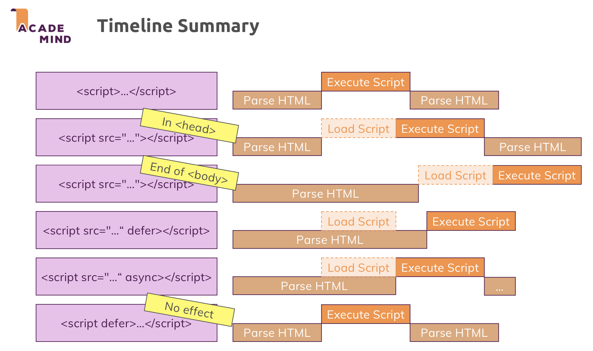

# `defer`와 `async`

Javascript로 작성한 코드를 최종적으로 HTML 파일에 불러와 사용하기 위해서 `<script>` 태그를 이용한다. 이러한 `<script>` 태그는 주로 `<head>` 태그 내부에 위치시키거나 `<body>` 태그의 맨 마지막에 위치시킨다.

`<script>` 태그의 위치에 따라 HTML 문서를 불러올 때 Javascript 코드가 실행되는 시점이 달라지게되며, 세부적인 차이점은 아래의 설명과 같다.

- `<head>` 태그 내부

  - Javascript 코드가 **`<body>` 태그를 불러오기 전에 다운로드** 되며, 완료 시 즉시 실행된다.
  - 따라서, `<body>` 태그 내부의 요소에 접근하는 Javascript 코드가 있을 때 **에러가 발생**한다.

- `<body>` 태그의 마지막
  - Javascript 코드가 **HTML 문서를 모두 불러온 뒤 다운로드** 되며, 완료 시 즉시 실행된다.
  - `<body>` 태그 내부의 요소에 접근하는 Javascript 코드가 있을 때 **정상적으로 실행**된다.

즉, `document.querySelector()`와 같은 **DOM API를 사용하는 코드가 Javascript 파일에 포함되어 있다면 `<body>` 태그의 맨 마지막에 `<script>` 태그를 위치**시켜야 한다.

[참고 1] `<head>` 태그 내부에 위치시키더라도 `addEventListener("load", () => {})`와 같이 HTML 문서를 모두 불러온 뒤 코드가 실행되도록 하면 사용할 수 있다.

[참고 2] `<script>` 태그의 `src` 속성을 사용해 Javscript 파일을 불러오지 않고 `<script>` 태그 내부에 직접 코드를 작성하는 경우, 다운로드 받지 않는다.

<br>

## 한계점

`<body>` 태그의 마지막에 `<script src="">` 태그를 위치시키면 **HTML 문서를 모두 불러온 뒤 Javascript 파일을 다운로드하기 시작**한다. 만약 `<body>` 태그에 작성된 HTML 코드가 굉장히 많다면, Javascript 파일을 다운로드하기 시작하는 시점은 늦어지게 되는 것이다.

하지만 우리가 정말 필요로 하는 것은 **HTML 문서를 불러온 뒤 Javascript 코드를 실행하는 것**이기 때문에, 굳이 Javscript 파일의 다운로드를 늦게 시작할 필요는 없다.

Javascript 파일의 크기는 어플리케이션의 규모에 따라 다르지만 대부분의 경우 HTML 문서보다 크며, 로컬 환경이 아닌 실제 외부 서버로부터 Javascript 파일을 다운받는 경우라면 시간이 오래 소요될 수 있다.

그렇기 때문에 HTML 문서의 `<body>` 태그 내용을 불러오기 이전에 Javascript 파일의 다운로드를 먼저 시작하고, HTML 문서의 불러오기가 종료될 때 Javascript 코드를 실행하도록 하는 것이 최선일 것이다.

<br>

## `defer` 속성

HTML 문서를 불러오고, 필요한 Javascript 코드를 실행하는 **최적의 시나리오**는 다음과 같을 것이다.

1. HTML 문서의 `<body>` 태그를 불러오기 이전에 Javascript 코드의 다운로드를 시작한다.
2. HTML 문서의 모든 내용을 불러온 뒤, 다운로드 된 Javascript 코드를 실행한다.

이와 같은 최적의 시나리오를 달성하는 방법은 아래의 예시와 같이 **`<script src="">` 태그를 `<head>` 태그 내부에 위치시키고, `<script>` 태그에 특별한 속성인 `defer`를 추가**해주면 된다.

```html
<!DOCTYPE html>
<html lang="en">
  <head>
    <meta charset="UTF-8" />
    <meta http-equiv="X-UA-Compatible" content="IE=edge" />
    <meta name="viewport" content="width=device-width, initial-scale=1.0" />
    <title>Best Scenario</title>
    <script src="assets/scripts/app.js" defer></script>
    <script src="assets/scripts/vendor.js" defer></script>
  </head>
  <body>
    <!-- Some HTML Tags -->
  </body>
</html>
```

`<script src="">` 태그를 `<head>` 태그 내부에 위치시키면 **HTML 문서를 불러오는 과정을 잠시 중단**하며 Javascript 파일을 다운로드 받고, 완료 시 Javascript 코드를 먼저 실행한다.

이 때 `<script>` 태그에 `defer` 속성을 추가하면 Javascript 파일의 다운로드를 먼저 시작하기는 하지만 **HTML 문서를 불러오는 전체 흐름을 중단하지 않는다.**

또한, Javascript 파일의 다운로드가 HTML 문서를 불러오는 것보다 먼저 완료되더라도 Javascript 코드를 즉시 실행하지 않고, **HTML 문서의 불러오기 과정이 마무리되는 시점까지 기다렸다가 실행**한다.

[참고] `app.js` 파일과 `verdor.js` 파일은 등록된 순서대로 실행된다. 즉, `app.js` 파일을 먼저 실행한 뒤 `verdor.js` 파일을 실행한다.

<br>

## `async` 속성

`<body>` 태그에 포함된 요소에 접근하지 않고 **독립적으로 실행될 수 있는 Javascript 코드**의 경우, 굳이 HTML 문서가 모두 불러와지는 시점까지 기다렸다가 실행할 필요가 없을 것이다.

이러한 경우 `defer` 속성 대신 `async` 속성을 사용하면 선제적으로 Javascript 파일의 다운로드를 시작하며, **HTML 문서 불러오기의 완료 여부와 관계 없이 Javascript 파일의 다운로드가 완료되면 해당 코드를 실행**하도록 할 수 있다.

만약 Javascript 파일이 HTML 문서의 불러오기가 완료되기 이전에 다운로드 완료되면, **HTML 문서의 불러오기를 잠시 중단하고 Javascript 코드가 실행**된다.

```html
<!-- Javascript 코드가 DOM API를 사용하지 않는 경우만 사용해야한다. -->
<script src="assets/scripts/app.js" async></script>
<script src="assets/scripts/vendor.js" async></script>
```

[참고] `app.js` 파일과 `verdor.js` 파일 중 먼저 다운로드 완료되는 것이 먼저 실행된다. 즉, Javascript 코드의 **실행순서는 네트워크 상태 및 파일 크기에 따라 매번 변경**될 수 있는 것이다.

<br>

## 결론

`defer` 속성과 `async` 속성은 오직 `src` 속성으로 외부 파일을 불러오는 `<script>` 태그에만 적용할 수 있다.

`<script>` 태그 내부에 직접 Javascript 코드를 작성한 경우, `defer` 속성 또는 `async` 속성을 추가하더라도 아무런 효과가 없다.

아래의 이미지는 Javascript 파일을 HTML 문서에 불러오는 모든 경우의 수에 대해 *HTML 문서의 불러오기*와 _Javascript 파일의 다운로드와 실행_ 순서를 나타내고 있다.


