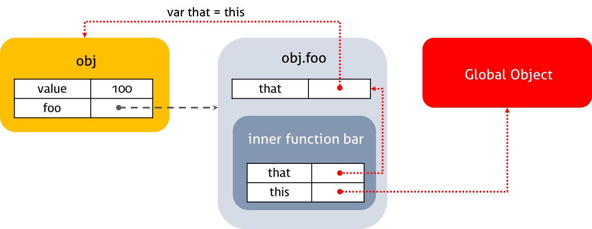

# `this` 바인딩

Javascript의 함수는 호출될 때 `()`를 통해 명시적으로 전달되는 매개변수 이외에, **`arguments 객체`와 `this`를 암묵적으로 전달** 받는다.

따라서 Javascript의 모든 함수 내부에서 `arguemnts`와 `this`를 통해 어떠한 값에 접근할 수 있다.

```javascript
function sum(numA, numB) {
  console.log(arguments); // 암묵적으로 전달된 값
  console.log(this); // 암묵적으로 전달된 값

  return numA + numB;
}

sum(10, 20); // 30
```

특히 `this`는 Java와 같은 언어에서의 `this`와 개념적으로 다르기 때문에, Javascript에서 `this`의 동작에 대해 명확히 알아둘 필요가 있다.

Java에서 `this`는 클래스의 생성자를 사용해 생성된 **인스턴스 자기자신을 가리키는 참조변수**이다. 주로 **전달된 매개변수와 인스턴스 내부에 가지고 있는 변수의 이름이 동일할 때, 이를 구분하**기 위해 사용된다.

```java
public Class Person {
    private String name;

    public Person(String name) {
        this.name = name;  // 매개변수와 내부변수(필드)의 이름을 구분
    }
}
```

하지만 Javascript의 `this`는 항상 객체 자기자신을 가리키지 않으며, **함수의 호출 방식에 따라 `this`에 바인딩되는 객체가 변화**한다.

<br>

## 함수 호출 방식과 `this`의 바인딩

Javascript의 경우 함수가 호출되는 방식에 따라 `this`에 바인딩되는 객체가 **동적으로 결정**된다. Java와 같이 `this`에 항상 동일한 객체가 바인딩되는 것이 아니라는 것이다.

[참고] 함수의 상위 스코프를 결정하는 방식인 *렉시컬 스코프*와는 다르다. *렉시컬 스코프*는 함수가 선언되는 위치에서 해당 함수의 상위 스코프를 결정하는 방식이다.

Javascript에서 함수를 호출할 수 있는 방법은 다음과 같다.

1. **함수 호출**
   - 일반적으로 `function()`과 같이 함수를 호출하는 것을 말한다.
2. **메서드 호출**
   - 메서드란, 객체 내부에 포함된 함수를 말한다.
   - 메서드 호출은 `object.function()`과 같은 형태이다.
3. **생성자 함수 호출**
   - 새로운 객체를 생성하기 위해 `new Object()`와 같이 호출하는 것을 말한다.
4. **`apply()`, `call()`, `bind()` 호출**
   - `Function` 객체의 `prototype`에 포함된 함수를 이용해 호출하는 것을 말한다.

```javascript
// 함수 표현식으로 함수 선언
var foo = function () {
  console.log(this);
};

// 1. 함수 호출
foo(); // window

// 2. 메서드 호출
var object = { foo: foo };
object.foo(); // object

// 3. 생성자 함수 호출
var instance = new foo(); // instance

// 4. apply(), call(), bind() 호출
var bar = { name: "bar" };
foo.call(bar); // bar
foo.apply(bar); // bar
foo.bind(bar)(); // bar
```

<br>

### 1. 함수 호출 시 `this` 바인딩

Javascript는 **모든 객체의 유일한 상위 객체인 전역 객체**를 가지는데, *브라우저*에서 실행되면 `window 객체`를, *Node.js*에서 실행되면 `global 객체`를 전역 객체로 가지게 된다.

전역 객체는 전역 스코프(= _Global Scope_ 또는 _File Scopre_)를 따르는 전역 변수(Global Variable)를 속성(Property)으로 소유한다.

전역 스코프에서 선언한 모든 함수는 전역 객체의 속성으로 접근할 수 있는 전역 객체의 메서드가 된다.

```javascript
var global = "Global";

console.log(global); // Global
console.log(window.global); // Global

function foo() {
  console.log("Global Object's Method");
}

window.foo(); // Global Object's Method
```

Javascript는 **기본적으로 `this`에 전역 객체를 바인딩**한다. 전역 스코프에서 선언된 함수는 물론, 그 함수의 내부에 선언된 **내부 함수에서도 `this`는 전역 객체**가 된다.

```javascript
function outer() {
  console.log(`outer's this: ${this}`);

  function inner() {
    console.log(`inner's this: ${this}`);
  }

  inner(); // inner: window
}

outer(); // outer: window
```

[중요] 또한, 객체의 **메서드의 내부 함수인 경우에도 `this`에 전역 객체가 바인딩**된다. 이 부분은 헷갈릴 수 있으므로 꼭 정확히 기억해 놓아야 한다.

```javascript
var value = 10;

var object = {
  value: 100,

  method: function () {
    console.log(`method's this: ${this}`); // object
    console.log(`method's this.value: ${this.value}`); // 100

    function methodInner() {
      console.log(`methodInner's this: ${this}`); // window
      console.log(`methodInner's this.value: ${this.value}`); // 10
    }

    methodInner();
  },
};

object.method();
```

[중요] 콜백 함수에서도 `this`에 전역 객체가 바인딩 된다.

```javascript
var value = 10;

var object = {
  value: 100,

  method: function () {
    setTimeout(function () {
      console.log(`callback's this: ${this}`); // window
      console.log(`callback's this.value: ${this.value}`); // 10
    }, 1000);
  },
};

object.method();
```

요약하자면 내부 함수는 일반 함수, 메서드, 콜백 함수 등 **선언된 위치와 관계없이 항상 `this`에 전역 객체(`window` 또는 `global`)가 바인딩** 된다.

내부 함수에서 `this`에 전역 객체가 바인딩되는 것을 방지하기 위해 `var that = this;`와 같이 **변수에 외부의 `this`를 저장하여 사용**하기도 한다.

```javascript
var value = 10;

var object = {
  value: 100,

  method: function () {
    var that = this; // that === object

    console.log("method's this: ", this); // object
    console.log("method's this.value: ", this.value); // 100

    function methodInner() {
      console.log("methodInner's this: ", this); // window
      console.log("methodInner's this.value: ", this.value); // 10

      console.log("methodInner's that: ", that); // object
      console.log("methodInner's that.value: ", that.value); // 100
    }

    bar();
  },
};

object.method();
```

위의 예시 코드를 그림으로 나타내면 다음과 같다.

<br>



<br>

### 2. 메서드 호출 시 `this` 바인딩

함수가 객체의 속성인 경우, 특별히 *메서드*라고 부른다.

객체에 포함된 메서드의 `this`에는 **해당 메서드를 소유한 객체**가 바인딩 된다. 즉, **해당 메서드를 호출한 객체**가 바인딩되는 것이다.

```javascript
var objectA = {
  name: "Lee",

  sayHello: function () {
    console.log(this.name);
  },
};

var objectB = {
  name: "Kim",
};

// objectB에 objectA의 "메서드에 대한 참조"만 복사된다.
objectB.sayName = objectA.sayName;

objectA.sayName(); // Lee
objectB.sayName(); // Kim
```

[주의] `objectA` 객체의 `sayHello` 속성은 함수이며, 함수는 *참조 타입*이므로 **함수에 대한 참조만 전달**될 뿐, 실제 함수가 복사되어 `objectB`에 전달되지는 않는다.

<br>


<br>

### 3. 생성자 함수 호출 시 `this` 바인딩

생성자 함수는 말 그대로 **새로운 객체를 생성하는 함수**를 말한다.

ES6에서 `constructor()`가 등장하기는 했지만, 그 이전까지 Javascript에는 별도의 생성자 함수가 존재하지 않았으며, **일반 함수에 `new` 키워드를 붙여서 호출하면 생성자 함수로 동작한다.**

이러한 특성 때문에 ES6 이전의 Javascript에서 생성자 함수를 선언할 때, **첫 문자를 대문자로 작성하는 방식으로 일반 함수와 생성자 함수를 구분**하였다.

```javascript
// 생성자 함수 (대문자)
function Person(name) {
  this.name = name;
}

var me = new Person("Lee");
console.log(me); // Person {name: "Lee"}

// new 키워드를 사용하지 않으면 생성자 함수로 동작하지 않는다.
var you = Person("Kim");
console.log(you); // undefined
```

`new` 키워드를 사용해 함수를 호출하면 `this` 바인딩이 일반 함수나 메서드를 호출하는 경우와는 다른 방식으로 일어난다.

#### **생성자 함수의 동작 방식**
