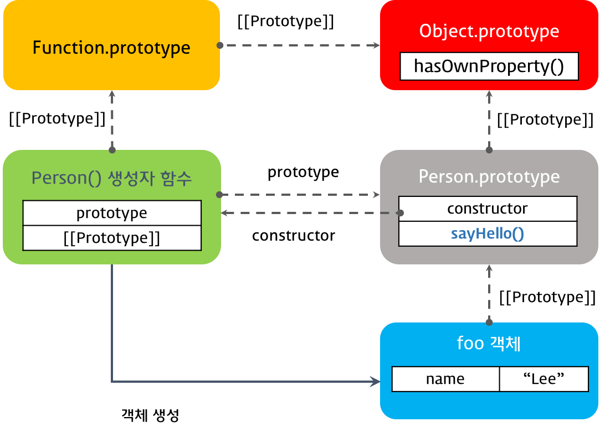

# 프로토타입

<br>

## 프로토타입 객체

Java와 같은 클래스 기반 객체지향 언어와 달리, Javascript는 **프로토타입 기반 객체지향 언어**다. 따라서, Javascript의 동작 원리를 이해하기 위해서는 프로토타입에 대한 이해가 필수적이다.

클래스 기반 객체지향 언어에서는 객체(= _인스턴스_) 생성을 위해 클래스를 정의하고, 클래스를 이용해 객체를 생성한다. 하지만 프로토타입 기반 객체지향 언어는 아래의 예시와 같이 **클래스가 없어도 객체를 생성하는 것이 가능**하다.

```javascript
// 1. 객체 리터럴을 이용
var personA = {
  name: "A",
};

// 2. Object 생성자를 이용
var personB = new Object();
personB.name = "B";

// 3. 생성자 함수를 이용
function Person(name) {
  this.name = name;
}

var personC = new Person("C");
```

Javascript의 **모든 객체는 자신의 부모 역할을 담당하는 객체와 연결**되어 있다. 그러므로 객체지향의 상속(_Inheritance_) 개념과 같이, **부모 객체의 속성이나 메서드를 사용**할 수 있다.

Javascript에서는 이러한 **부모 객체를 프로토타입(_Prototype_) 객체**라고 부른다. 프로토타입 객체는 생성자 함수에 의해 생성된 각각의 객체(= _인스턴스_)에 공유 속성을 제공하기 위해 사용된다.

```javascript
var student = {
  name: "Lee",
};

console.log(student.hasOwnProperty("name")); // true
```

위의 예시에서 `hasOwnProperty()`는 `student` 객체의 속성이 아니지만, `student` 객체의 프로토타입 객체(= _부모 객체_)인 `Object`에 그러한 메서드가 존재하기 때문에 사용할 수 있다.

[참고] Javascript의 모든 객체는 [[Prototype]]이라는 내부 슬롯(_Internal Slot_)을 가진다. [[Prototype]]의 값은 `null` 또는 객체이며, 상속을 구현하기 위해 사용된다.

[[Prototype]] 내부 슬롯의 값은 프로토타입 객체이며, **`__proto__`라는 *Getter 속성*을 사용해 접근**할 수 있다. 예를 들어, `student` 객체에서 `__proto__`는 자기자신의 프로토타입 객체(= 부모 객체)인 `Object.prototype`을 가리킨다.

```javascript
var student = {
  name: "Lee",
};

console.log(student.__proto__ === Object.prototype); // true
```

<br>

## prototype 속성 vs. [[Prototype]]

Javascript에서는 함수 또한 객체이므로, 함수 역시 [[Prototype]] 내부 슬롯을 가진다.

그러나 함수 객체(= `Function`)의 경우, 일반 객체와 다르게 `prototype` 속성(= _Property_)도 가진다.

```javascript
function Person(name) {
  this.name = name;
}

var person = new Person("Lee");

console.dir(Person); // prototype 속성 포함 O
console.dir(person); // prototype 속성 포함 X
```

- [[Prototype]]

  - 함수를 포함한 Javascript의 모든 객체가 가지고 있는 내부 슬롯이다.
  - 객체의 입장에서 **자기자신의 부모 역할을 하는 프로토타입 객체**를 가리키며, 함수 객체(= `Function`)의 경우 `Function.prototype`을 가리킨다.

    ```javascript
    // __proto__를 사용해 [[Prototype]]에 접근
    console.log(Person.__proto__ === Function.prototype); // true
    ```

- `prototype` 속성

  - 함수 객체만 가지고 있는 특별한 속성이다.
  - 함수 객체가 생성자로 사용될 때, 그 함수를 통해 **생성될 객체의 부모 역할을 하는 프로토타입 객체**를 가리킨다.

    ```javascript
    // person.prototype은 없다.
    console.log(person.__proto__ === Person.prototype); // true
    ```

<br>

## constructor 속성

프로토타입 객체는 `constructor` 속성을 가진다. 이 **`constructor` 속성은 객체의 입장에서 자기자신을 생성한 객체**를 가리킨다. 예를 들어 `Person()` 생성자 함수에 의해 생성된 객체 `person`을 보자.

- 이 `person` 객체를 생성한 객체는 `Person()` 생성자 함수이다.

- 이때 `person` 객체 입장에서 자기자신을 생성한 객체는 `Person()` 생성자 함수이며, 따라서 `person` 객체의 프로토타입 객체는 `Person.prototype`이다.

- 따라서 프로토타입 객체 `Person.prototype`의 `constructor` 속성은 `Person()` 생성자 함수를 가리킨다.

```javascript
function Person(name) {
  this.name = name;
}

var person = new Person("Lee");

// Person() 생성자 함수에 의해 생성된 객체를 생성한 객체는 Person() 생성자 함수이다.
console.log(Person.prototype.constructor === Person);

// person 객체를 생성한 객체는 Person() 생성자 함수이다.
console.log(person.constructor === Person);

// Person() 생성자 함수를 생성한 객체는 Function() 생성자 함수이다.
console.log(Person.constructor === Function);
```

<br>

## 프로토타입 체인 (_Prototype Chain_)

Javascript는 특정 객체의 속성/메서드에 접근하려고 할 때, 객체 내부에 해당하는 속성/메서드가 존재하지 않으면 [[Prototype]]이 가리키는 링크를 따라 **대상 객체의 부모 역할을 하는 프로토타입 객체의 속성/메서드를 차례대로 탐색**한다. 이것을 프로토타입 체인이라고 한다.

```javascript
var student = {
  name: "Lee",
};

// Object.prototype.hasOwnProperty()
console.log(student.hasOwnProperty("name")); // true
```

위의 예시에서 `student` 객체의 내부에는 `hasOwnProperty()` 메서드가 존재하지 않는다. 따라서 `student`의 프로토타입 객체인 `Object.prototype`에서 `hasOwnProperty()` 메서드의 존재를 탐색하게 되며, `Object.prototype`는 `hasOwnProperty()` 메서드를 가지고 있으므로 호출할 수 있는 것이다.

<br>

### 객체 리터럴 방식으로 생성된 객체의 프로토타입 체인

*객체 리터럴 방식*으로 생성된 객체는, 결국 내장 함수(_Built-in Function_)인 **`Object()` 생성자 함수로 객체를 생성하는 것을 단순화**시킨 것이다.

`Object()` 생성자 함수는 일반 객체가 아닌 함수 객체이므로, `prototype` 속성을 가진다.

```javascript
// 객체 리터럴은 내부적으로 Object() 생성자 함수 호출
var person = {
  name: "Lee",
};

console.log(person.__proto__ === Object.prototype); // 1. true
console.log(Object.prototype.constructor === Object); // 2. true
console.log(Object.__proto__ === Function.prototype); // 3. true
console.log(Function.prototype.__proto__ === Object.prototype); // 4. true
```

<br>


<br>

결론적으로 객체 리터럴을 사용하여 객체를 생성한 경우, 그 **객체의 프로토타입 객체는 Object.prototype**인 것이다.

<br>

### 생성자 함수로 생성된 객체의 프로토타입 체인

생성자 함수로 객체를 생성하기 위해서 먼저 생성자 함수를 정의해야 하는데, Javascript에서 함수를 선언하는 방법은 세 가지가 있다.

- 함수 선언식
  - `function foo() {};`
  - *함수 리터럴*을 사용하는 방식이다.
- 함수 표현식
  - `var foo = function() {};`
  - *함수 리터럴*을 사용하는 방식이다.
- `Function()` 생성자 함수
  - `var foo = new Function();`

*함수 리터럴*은 `Function()` 생성자 함수로 함수를 생성하는 것을 단순화 시킨 것이다. 즉, 위의 세 가지 함수 정의 방식은 **결국 Function() 생성자 함수를 통해 함수 객체를 생성**하는 것이라고 할 수 있다.

따라서 어떠한 방식으로 함수 객체를 생성하여도 **모든 함수 객체의 프로토타입 객체는 Function.prototype**이다.

생성자 함수도 함수 객체이므로 **생성자 함수의 프로토타입 객체도 Function.prototype**이다.

```javascript
function Person(name, gender) {
  this.name = name;
}

var person = new Person("Lee");

console.log(person.__proto__ === Person.prototype); // 1. true
console.log(Person.prototype.__proto__ === Object.prototype); // 2. true
console.log(Person.prototype.constructor === Person); // 3. true
console.log(Person.__proto__ === Function.prototype); // 4. true
console.log(Function.prototype.__proto__ === Object.prototype); // 5. true
```

<br>


<br>

`person` 객체의 프로토타입 객체인 `Person.prototype`과 `Person()` 생성자 함수의 프로토타입 객체인 `Function.prototype`의 프로토타입 객체는 `Object.prototype`이다.

이는 객체 리터럴 방식이나 생성자 함수 방식이나 결국은 **모든 객체의 부모 객체인 `Object.prototype` 객체에서 프로토타입 체인 종료**되기 때문이다.

따라서 `Object.prototype` 객체를 **프로토타입 체인의 종점**(_End of prototype chain_)이라 한다.

<br>

## 프로토타입 객체의 확장

프로토타입 객체도 마찬가지로 객체이므로, 일반 객체와 같이 속성/메서드를 추가하거나 삭제할 수 있다. 이렇게 추가되거나 삭제된 속성/메서드는 그 **즉시 프로토타입 체인에 반영**된다.

```javascript
function Person(name) {
  this.name = name;
}

var person = new Person("Lee");

// person 객체의 프로토타입 객체에 sayHello() 메서드 추가
Person.prototype.sayHello = function () {
  console.log("Hi! my name is " + this.name);
};

foo.sayHello(); // Hi, my name is Lee
```

생성자 함수 `Person()`의 `prototype` 속성은 프로토타입 객체 `Person.prototype`과 바인딩 되어있다. `Person.prototype`은 일반 객체와 같이, 속성/메서드를 추가하거나 삭제할 수 있다.

위의 예시에서는 `Person.prototype` 객체에 `sayHello()`라는 메서드를 추가하고 있다. 이때 `sayHello()` 메서드는 프로토타입 체인에 즉시 반영된다.

생성자 함수 `Person()`에 의해 생성된 모든 객체는 `Person.prototype`을 프로토타입 객체로 가지므로, `sayHello()` 메서드를 사용할 수 있게된다.

<br>


