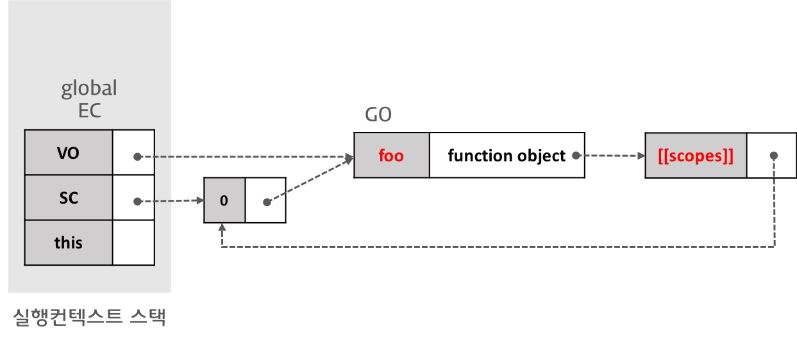
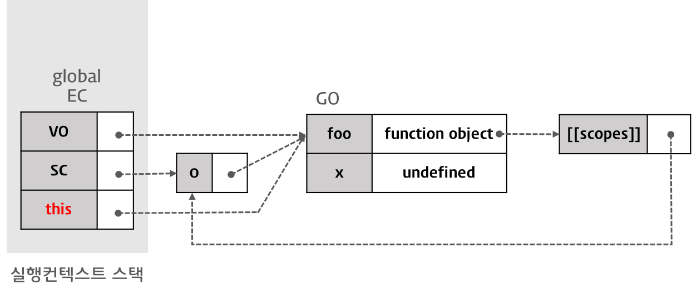

# 실행 컨텍스트 (_Execution Context_)

<br>

## **실행 컨텍스트란?**

실행 컨텍스트는 _scope_, _hoisting_, _this_, _function_, _closure_ 등 Javascript의 동작 원리를 담고있는 핵심적인 내용이다.

ECMAScript는 이러한 실행 컨텍스트를 **실행 가능한 코드를 형상화하고 구분하는 추상적인 개념**으로 정의한다. 간단히 말해서, 실행 컨텍스트는 **실행 가능한 코드가 실제로 실행되기 위해 필요한 환경**이다.

*실행 가능한 코드*는 다음의 세 가지를 의미한다.

- 전역 코드: 전역 스코프에 존재하는 코드
- 함수 코드: 함수 스코프에 존재하는 코드
- `eval()` 코드: `eval()` 내부에 포함된 표현식

Javascript로 작성된 코드는 *Javascript Engine*에 의해 실행된다. *Javascript Engine*은 **코드를 실행하기 위해 여러가지 정보를 필요**로 하는데, 대체적으로 다음과 같다.

- 변수: 전역 변수, 지역 변수, 매개 변수, 객체의 속성
- 함수 선언
- 변수의 유효범위(= _스코프_)
- `this`

```javascript
// [1] 전역 실행 컨텍스트 생성
var x = "xxx";

function foo() {
  var y = "yyy";

  function bar() {
    var z = "zzz";
    console.log(x + y + z);
  }
  bar(); // [3] 함수 실행 컨텍스트 생성
}
foo(); // [2] 함수 실행 컨텍스트 생성
```

위의 코드를 실행하면 아래와 같이 **실행 컨텍스트 스택(_Stack_)이 생성**되고, 또 소멸된다. 현재 실행 중인 컨텍스트에서 해당 컨텍스트와 관련이 없는 코드가 실행되려고 하면, 새로운 컨텍스트가 생성된다. 새롭게 생성된 컨텍스트는 스택에 추가되며, **제어권(_Control_)이 이동**된다.

<br>


1. 제어권이 실행 가능한 코드로 이동하면, 새로운 실행 컨텍스트 스택이 생성된다.
2. 전역 코드로 제어권이 진입하면 **전역 실행 컨텐스트**가 생성되며, 스택에 추가된다. 전역 실행 컨텍스트는 어플리케이션이 종료되는 시점까지 유지된다.
3. 함수를 호출하면 해당 **함수의 실행 컨텍스트**가 생성되며, 스택에 추가된다.
4. 함수 실행이 종료되면 해당 함수의 실행 컨텍스트를 스택에서 제거하며, **직전의 실행 컨텍스트로 제어권을 반환**한다.

<br>

## **실행 컨텍스트의 3가지 객체**

실행 컨텍스트는 실행 할 수 있는 코드를 형상화하고 구분하는 추상적인 개념이지만, **물리적으로는 객체의 형태를 가지며 아래의 세 가지 속성**을 가진다.


<br>

### **1. 변수 객체 (_Variable Object_, _VO_)**

실행 컨텍스트가 최초로 생성되면 *Javascript Engine*은 **실행에 필요한 여러 정보를 보관할 수 있는 객체**를 생성하며, 이것은 변수 객체라고 부른다.

변수 객체는 다음의 정보를 보관한다.

- 변수
- 매개변수(_Parameters_) 및 인수(_Arguments_)
- 함수 선언(_표현식은 제외_)

변수 객체는 실행 컨텍스트라는 물리적 객체의 속성(_Property_)이기 때문에 어떠한 값(_Value_)을 가지며, 이 값은 다른 객체를 가리킨다.

다만 전역 코드 실행 시 생성되는 **전역 컨텍스트**의 변수 객체와 함수 실행 시 생성되는 **함수 컨텍스트**의 변수 객체가 **가리키는 객체는 서로 다르다.** 이는 전욕 코드와 함수의 내용이 다르기 때문이며, 예를 들어 전역 코드는 매개변수(_Parameter_)가 존재하지 않는다.

변수 객체가 가리키는 객체는 아래와 같다.

- **전역 컨텍스트의 변수 객체**

  - 변수 객체는 유일하고 최상위에 위치하며, 모든 전역 변수와 전역 함수를 포함하는 **전역 객체, Global Object**를 가리킨다.
  - 전역 객체는 전역으로 선언된 변수와 함수를 속성으로 가진다.

    

- **함수 컨텍스트의 변수 객체**

  - 변수 객체는 **활성 객체, Activation Object**를 가리킨다.
  - 활성 객체에는 함수의 매개변수와 인수에 대한 정보를 담고 있는 `arguments` 객체가 추가된다.

    

<br>

### **2. 스코프 체인 (_Scope Chain_, _SC_)**

스코프 체인은 일종의 리스트(_List_)로서, 전역 객체와 중첩된(_Nested_) 함수의 **스코프에 대한 참조(_Reference_)를 차례대로 저장**한다.

다시 말해, 스코프 체인은 현재의 실행 컨텍스트에서 참조할 수 있는 변수 및 함수 선언과 같은 정보를 담고 있는 **전역 객체(_GO_) 또는 활성 객체(_AO_)에 대한 참조로 이루어진 리스트**이다.

스코프 체인은 현재 실행 컨텍스트의 활성 객체를 선두로 하며, 순차적으로 상위 컨텍스트의 활성 객체에 대한 참조를 가진다. 리스트의 **마지막은 항상 전역 객체에 대한 참조**이다.

<br>


<br>

`foo()`의 호출로 인해 생성된 함수 컨텍스트의 스코프 체인은 **가장 먼저 자신의 활성 객체에 대한 참조**를 가지고 있다. 위에서 언급한 것과 같이, **스코프 체인의 마지막은 전역 객체에 대한 참조**이다.

중첩된 함수(_Nested Function_)의 **내부 함수에서 외부 함수의 스코프와 전역 스코프까지 참조가 가능**한데, 이것은 위와 같은 스코프 체인 검색을 통해 이루어지는 것이다. 함수가 중첩될 때마다 **외부 함수의 스코프가 내부 함수의 스코프 체인에 포함**된다.

함수 실행중에 어떤 변수를 만나면 그 변수를 우선 현재의 스코프, 즉 **활성 객체에서 검색**해보고, 존재하지 않으면 스코프 체인의 순서를 따라 다른 스코프에서 검색을 이어가게 되는 것이다.

[참고] 스코프 체인(_Scope Chain_)은 식별자 중에서 객체(_전역 객체 제외_)의 속성이 아닌 식별자, 즉 **변수를 검색하는 메커니즘**이다. 객체의 속성(_메서드 포함_)를 검색하는 메커니즘은 프로토타입 체인(_Prototype Chain_)이다.

<br>

### **3. thisValue**

실행 컨텍스트에 포함되는 세 번째 객체인 `thisValue`에는 `this` 값이 할당된다. `this`에 할당되는 값은 함수 호출 패턴에 의해 결정된다.

<br>

# **실행 컨텍스트의 생성 과정**

## **1. 전역 코드 진입**

제어권이 실행 컨텍스트에 진입하기에 앞서, 유일한 **전역 객체(_Global Object_)가 생성**된다.

전역 객체는 단일 사본으로 존재하며 이 객체의 속성에는 코드의 어느 위치에서도 접근할 수 있다.

초기 상태의 전역 객체에는 `Math`, `String`과 같은 내장 객체(_Built-in Objects_)와 _BOM_, *DOM*이 포함되어 있다.

전역 객체가 생성된 이후, 제어권이 본격적으로 전역 코드로 진입하면 **전역 실행 컨텍스트가 생성되고 실행 컨텍스트 스택에 추가**된다.

<br>

### **1.1. 스코프 체인의 생성과 초기화**

전역 코드에 진입하여 전역 실행 컨텍스트가 생성된 이후, 가장 먼저 스코프 체인의 생성과 초기화가 진행된다.

이때 스코프 체인은 전역 객체에 대한 참조를 가지는 리스트가 된다.


<br>

### **1.2. 변수 객체화(_Variable Instantiation_) 실행**

스코프 체인의 생성과 초기화 과정이 종료되면, 변수 객체화를 진행한다.

변수 객체화는 변수 객체에 속성(_key와 value_)을 추가하는 것을 말하는데, 일반 변수 이외에도 **매개변수, 인수, 함수 선언이 변수 객체화의 대상으로 포함**된다.

전역 코드인 경우 변수 객체는 전역 객체를 가리키며, 함수인 경우 활성 객체를 가리킨다.


변수 객체화는 다음과 같은 순서로 변수 객체에 속성을 추가한다. 순서는 변하지 않는다.

1. (함수 코드인 경우) 변수 객체에 속성이 추가되며, **매개변수가 *key*로, 인수가 *value*로 설정**된다.
2. 함수 표현식을 제외한 함수 선언이 변수 객체의 속성으로 추가되며, **함수명이 _key_, 생성된 함수 객체가 *value*로 설정**된다. (_함수 호이스팅_)
3. 변수 선언이 변수 객체의 속성으로 추가되며, **변수명이 _key_, `undefined`가 *value*로 설정**된다. (_변수 호이스팅_)

```javascript
// 전역 코드 진입 지점
var x = "xxx";

function foo() {
  /* 생략 */
}
```

#### **1.2.1 함수 `foo()`의 선언 처리**

함수 선언 `function foo() {}`는 변수 객체화 순서 중 두 번째에 따라 처리된다.

선언된 함수명 `foo`가 실행 컨텍스트의 변수 객체 속성에 추가되는데, 새로운 속성의 _key_ 값은 `foo`가 되며, *value*는 생성된 함수 객체가 된다.



생성된 함수 객체는 `[[Scope]]` 속성을 가진다. `[[Scope]]` 속성은 **함수 객체만 가질 수 있는 내부 속성**으로서, 함수 객체가 실행되는 환경을 가리킨다.

따라서 현재 실행 컨텍스트의 스코프 체인이 참조하고 있는 객체를 `[[Scope]]` 속성의 값으로 설정한다.

내부 함수의 `[[Scope]]` 속성은 자신자신의 실행 환경과 더불어, 자기자신을 포함하고 있는 외부 함수의 실행 환경과 전역 객체를 가리킨다.

이때 자기자신을 포함하는 외부 함수의 실행 컨텍스트가 스택에서 제거되어도 `[[Scope]]` 속성이 가리키는 외부 함수의 실행환경은 소멸하지 않으며, 이것을 **클로저**라고 한다.

지금까지 살펴본 실행 컨텍스트는 아직 코드가 실행되기 이전이지만, 스코프 체인이 가리키는 변수 객체에 이미 함수가 등록되어 이후 코드를 실행할 때 함수선언식 이전에도 함수를 호출할 수 있다. 이러한 현상을 **함수 호이스팅**이라고 한다.

#### **1.2.2. 변수 `x`의 선언 처리**

변수 선언 `var x = "xxx"`는 변수 객체화 순서 중 세번째에 따라 처리된다.

선언된 변수명 `x`가 변수 객체에 새롭게 생성되는 속성의 _key_ 값이 되며, 속성의 *value*는 `undefined`로 설정된다.

`var` 키워드를 사용해 선언된 변수는 **선언 단계와 초기화 단계를 동시에 진행**한다. 이미 변수 객체에 변수가 등록되고 값도 가지고 있으므로, 변수 선언문 이전에 변수에 접근할 수 있다. 이러한 현상을 **변수 호이스팅**이라고 한다.


<br>

### **1.3. thisValue의 결정**

변수 선언 처리가 종료되면, 다음으로 thisValue가 결정된다. thisValue가 결정되기 이전에는 전역 객체를 가리키고 있다가 **함수 호출 방식에 의해 this에 할당되는 값이 결정**된다. 전역 코드의 경우, thisValue는 전역 객체를 가리킨다.



<br>

## **2. 전역 코드 실행**

```javascript
var x = "xxx"; // [1] 변수 값 할당

function foo() {
  var y = "yyy";

  function bar() {
    var z = "zzz";
    console.log(x + y + z);
  }
  bar();
}

foo(); // [2] 함수 호출
```

### **2.1. 변수 `x`에 값 할당**

전역 변수 `x`에 문자열 `xxx`를 할당할 때, 현재 실행 컨텍스트의 스코프 체인이 참조하고 있는 변수 객체를 선두부터 검색한다.

변수 객체에서 변수명 `x`에 해당하는 속성이 발견되면 값 `xxx`를 할당한다.

### **2.2. 함수 `foo()`의 실행**

전역 코드의 함수 `foo()`가 실행되기 시작하면, **새로운 함수 컨텍스트가 생성되고 스택에 추가**된다.

함수 `foo()`의 실행 컨텍스트로 제어권이 이동하면 전역 코드의 경우와 마찬가지로 다음의 과정을 수행한다.

1. 스코프 체인의 생성과 초기화
2. 변수 객체화 실행
3. thisValue 결정

단, 전역 코드와 달리 함수 코드이므로 약간은 다른 규칙에 따라 위의 과정이 수행된다.

#### **2.2.1 스코프 체인의 생성과 초기화**

함수 코드의 스코프 체인의 생성과 초기화는 우선 **활성 객체에 대한 참조를 스코프 체인의 선두에 추가하는 것으로 시작**된다.

다음으로는 **함수를 호출한 컨텍스트(= _여기서는 전역 컨텍스트_)의 스코프 체인이 참조하고 있는 변수 객체가 스코프 체인의 후미에 추가**된다.

따라서 함수 `foo()`를 실행한 직후, 함수 컨텍스트의 스코프 체인은 활성 객체와 전역 객체를 순서대로 참조한다.

#### **2.2.2 변수 객체화 실행**

함수 코드의 경우, 활성 객체가 변수 객체라는 것을 제외하면 전역 코드의 경우와 동일하게 변수 객체화를 실행한다.

먼저 함수 `foo()`의 내부 함수인 `bar()`에 대한 작업이 처리되며, 활성 객체의 새로운 속성으로 추가된다. 속성의 *key*는 함수명이며 *value*는 생성된 함수 객체이다.

다음으로 변수 `y`에 대한 작업을 처리하며, 활성 객체의 새로운 속성으로 추가된다. 속성의 *key*는 변수명이며 *value*는 `undefined`이다.

#### **2.2.3 thisValue 결정**

변수 선언 처리가 끝나면 다음은 thisValue가 결정되는데, this에 할당되는 값은 함수 호출 방식에 따라 변화한다.

내부 함수의 경우, thisValue는 전역 객체이다.

<br>

## **3. `foo()` 함수 코드 실행**

### **3.1. 변수 `y`에 값 할당**

전역 변수 `y`에 문자열 `yyy`를 할당할 때, 현재 실행 컨텍스트의 스코프 체인이 참조하고 있는 변수 객체를 선두부터 검색한다.

변수 객체에서 변수명 `y`에 해당하는 속성이 발견되면 값 `yyy`를 할당한다.

### **3.2. 함수 `bar()`의 실행**

전역 코드의 함수 `bar()`가 실행되기 시작하면, **새로운 함수 컨텍스트가 생성되고 스택에 추가**된다.

함수 `bar()`의 실행 컨텍스트로 제어권이 이동하면 마찬가지로 다음의 과정을 수행한다.

1. 스코프 체인의 생성과 초기화
2. 변수 객체화 실행
3. thisValue 결정

최종적으로 완성된 실행 컨텍스트의 모습은 아래의 그림과 같다.


이 단계에서 `console.log(x + y + z);` 구문의 실행 결과는 `xxxyyyzzz`가 된다.

- `x` : AO-2에서 `x` 검색 실패 → AO-1에서 `x` 검색 실패 → GO에서 `x` 검색 성공 (값은 `xxx`)
- `y` : AO-2에서 `y` 검색 실패 → AO-1에서 `y` 검색 성공 (값은 `yyy`)
- `z` : AO-2에서 `z` 검색 성공 (값은 `zzz`)
