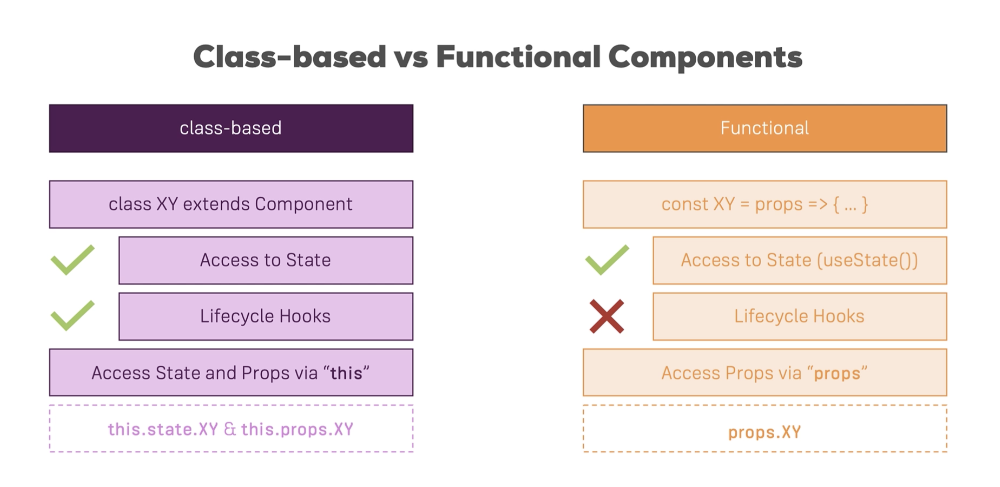

# 클래스형 컴포넌트 vs 함수형 컴포넌트

## 클래스형 컴포넌트

```
import { Component } from "react";

class ABC extends Component { ... };
```

클래스형 컴포넌트는 위의 예시와 같이, `react` 패키지의 `Component` 클래스를 상속하는 방식으로 생성할 수 있다.

### 상태 관리

클래스 컴포넌트는 React 16.8 버전 이전까지는 **State를 관리할 수 있는 유일한 컴포넌트**였으며, 따라서 16.8버전 이전에 작성된 모든 React 어플리케이션의 **State 관리**는 클래스 컴포넌트에서만 이루어지고 있다.

### 라이프 사이클 훅

또한, 아직 공부하지는 못했지만 **Lifecycle Hook**이라 불리우는 것을 지원하는데, 아마도 Vue.js의 `created`, `mounted`, `updated`와 같이 **컴포넌트의 생명주기에 특정한 로직을 수행할 수 있도록 해주는 기능**일 것이다.

### State와 Props 접근방식

클래스형 컴포넌트의 경우, 상속 받은 `Component` 클래스가 **State**와 **Props**를 **클래스의 속성으로 가지고 있기 때문에, this 키워드(`this.props` 또는 `this.state`)를 사용해이들에 접근**할 수 있다.

<br>

## 함수형 컴포넌트

```
const ABC = (props) => { ... };
```

함수형 컴포넌트는 위의 예시와 같이, 일반적으로 함수를 생성하는 문법을 통해 생성할 수 있다. 함수의 첫번째 인자로는 React에서 제공하는 `props`가 제공된다.

### 상태 관리

함수형 컴포넌트는 주로 **Presentational** 컴포넌트, 즉 **State**를 가지지 않고 `props`를 통해 외부에서 데이터를 전달받아 렌더링하기만 하는 컴포넌트를 생성하기 위해 사용되었다.

하지만 React 16.8 버전 이후, **React Hooks**가 등장하면서 함수형 컴포넌트도 **State를 관리할 수 있는 컴포넌트**가 되었으며, `useState()`라는 Hook을 사용해 활성화 할 수 있다.

### 라이프 사이클 훅

함수형 컴포넌트는 **Lifecycle Hook** 자체는 지원하지 않지만, **React Hooks**의 `useEffect()`를 사용해 **Lifecycle Hook**과 동일한 기능을 수행하도록 구현할 수 있다.

최근에는 클래스형 컴포넌트를 많이 사용하지 않고, 대부분 함수형 컴포넌트를 사용하기 때문에 `useEffect()`를 사용한 컴포넌트의 생명주기 관리 방법을 반드시 알아야 한다.

# ## State와 Props 접근방식

함수형 컴포넌트는 **State**와 **Props**에 접근하는 방법이 상이하다.

**Props**의 경우, 함수형 컴포넌트 생성 시 첫번째 인자로 받아오기 때문에 **`this` 키워드를 사용하지 않고 일반적으로 함수 내에서 인자에 접근하는 것과 동일하게 `props`에 접근**할 수 있다.

**State**의 경우, 아직 공부하지 않았으므로 이에 대해 공부할 때 다시 정리하도록 한다.

<br>

## 참고 내용


