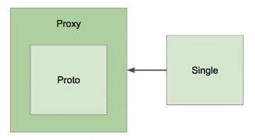

# Scope of Bean 

현재까지 등록한 모든 Bean에는 Scope라는 것이 있는데, 아무런 설정이 없는 경우  
Bean의 기본 Scope는 Singleton Scope로 적용되게 된다.

여기서 Singleton Scope를 가지는 Bean이란, 애플리케이션 전반에 걸쳐서 생성된  
해당 Bean의 인스턴스가 오직 한 개 뿐이라는 것을 의미한다. 즉, 하나의 객체만 생성되어 재활용 된다.

Bean이 가질 수 있는 Scope는 다양하며, 아래와 같다.

- Possible Scope of Bean
  - **Singleton**
  - Prototype
    - Request
	- Session
	- WebSocket
	- etc...

Prototype Scope는 매번 새로운 인스턴스를 생성하는 Scope이며 Request, Session 등과 같은 Scope도  
이와 거의 유사한 개념이며, 단지 새로운 인스턴스가 생성되는 상황만 각각 다른 것이다.
다음 코드와 같이 `@Scope` Annotation을 통해 Bean의 Scope를 지정할 수 있다.

```
@Component @Scope("prototype")
public class Bean { ... }
```

## Issues

1. Prototype Scope Bean이 Singleton Scope Bean을 참조  

```
public class Proto {
	@Autowired
	Single singleton;
}
```

이와 같은 경우, Prototype Scope를 가지는 Bean이 계속해서 생성되더라도, 참조하고 있는  
Singleton Scope Bean은 단 한번만 생성되고 재사용되기 때문에 **매번 동일한 Bean을 참조**하게 된다.  

2. Singleton Scope Bean이 Prototype Scope Bean을 참조  

```
public class Single {
	@Autowired
	private Proto prototype;

	public Proto getPrototype() {
		return prototype;
	}
}
```

하지만 위와 같은 경우, Singleton Scope를 가지는 Bean은 Application 전반에 걸처 단 한번만 생성되기  
때문에 그 안에서 참조하고 있는 Prototype Scope Bean 역시 Singleton Scope Bean이 생성되는 시점에 참조한  
Prototype Scope Bean으로 남아있게 된다. 즉, **Prototype Scope Bean이 업데이트 되지 않는 문제가 발생한다.**  

## Issue Solving

위의 2번 문제를 해결하기 위해서, 크게 세 가지의 방법을 적용할 수 있다.

1. Scoped-Proxy

```
@Component @Scope(value = "prototype", proxyMode = ScopedProxyMode.TARGET_CLASS)
public class Bean { ... }
```

`proxyMode = ScopedProxyMode.TARGET_CLASS` 속성을 `@Scope` Annotation에 추가하여 해결할 수 있다.  
proxyMode 설정의 기본 값은 DEFAULT이며, Proxy를 사용하지 않는다는 뜻이다.



위의 그림이 나타내듯, Prototype Scope Bean을 직접 참조하지 않게 한다.  
Singleton Scope Bean이 Prototype Scope Bean을 감싸는 Proxy를 생성해 참조하도록 하면,  
실제 Prototype Scope Bean는 계속해서 새로 생성되며 Singleton Scope Bean에서 사용될 수 있다.

[참고] 기존 JDK 상에서는 Interface 기반의 Proxy만 생성 가능하다.  
따라서 Class 기반의 Proxy를 생성하려면 Third-Party Library를 사용해야 한다.


2. Obejct Provider

```
public class Single {
	@Autowired
	private ObjectProvider<Proto> prototype;

	public Proto getPrototype() {
		return prototype.getIfAvailable();
	}
}
```

Spring에서 지원하는 ObjectProvider Class를 사용해 이러한 문제를 해결할 수도 있다.

3. Provider (표준)

## Singleton Scope 사용 시 주의할 점

1. Shared Property

Singleton Scope의 Bean은 많은 곳에서 참조되며 수정될 수 있다.
객체의 필드 변수가 여러 곳에서 수정되는 경우, 해당 값의 **안정성(*Thread Safe*)을 보장할 수 없게 된다**.

Multi-Thread 환경에서 Singleton Scope Bean의 필드 변수 값이 변할 때,
Thread A와 Thread B가 해당 값을 동시에 조작하려고 하는 경우 문제가 발생할 수 있다.

따라서 코딩할 때, *Thread Safe* 하도록 고려하여 작성해야 한다. 

2. Instance Creation

Singleton Scope로 지정된 모든 Bean은 ApplicationContext를 만들 때 같이 생성된다. 
즉, 어플리케이션을 초기에 구동하는 시점에서 객체가 생성되며, 이러한 객체가 재사용되는 것이다.
따라서, IoC Container에 등록된 Bean의 개수가 굉장히 많다면 초기 구동시간이 느려질 수도 있다.
