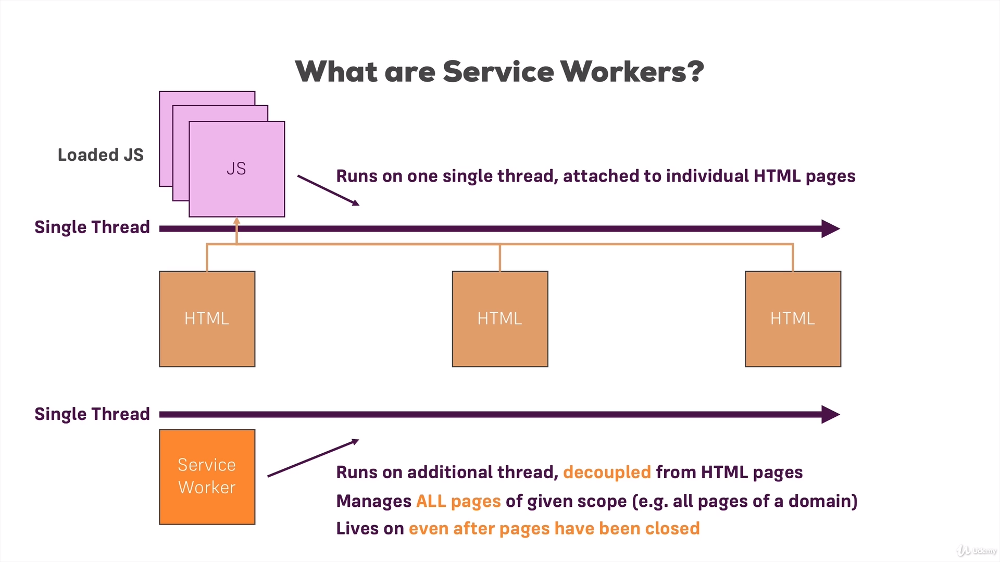
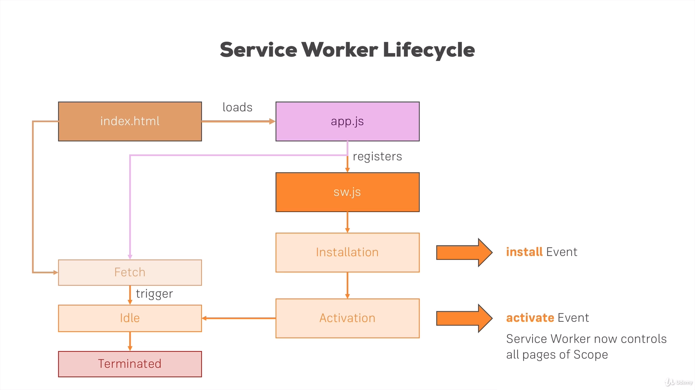

# PWA - Service Worker

*Service Worker*는 Web App이 인터넷에 연결되어 있지 않은 **오프라인 상태**에서도  
전체 기능의 100%는 아니지만 다음과 같은 화면이 아니라, **일부 기능을 제공**할 수 있도록 한다.


더불어, PWA의 주요 기능 중 하나라고 할 수 있는 *Push Notification*, *Background Syncronization*과 같은
***Next Generation Web Application Features*를 사용**할 수 있도록 해준다.


## Normal JS vs. Service Worker

기존의 방식은 Client가 Request를 통해 Server에서 HTML, CSS, Javascript 파일을 받고  
이러한 파일을들 통해 페이지를 렌더링하게 된다. 그 다음, Javascript를 통해 사용자의 필요에 따라  
Server 측으로 API Call을 수행하여 데이터를 받아오는 방식이었다.

이때, HTML 페이지에 의해 로드된 **Javascript 파일들은 단일 스레드에서 작동**하며  
만약 하나의 HTML 페이지에서 다수의 Javascript 파일을 로드하더라도, 이들 **모두 단일 스레드를 공유**한다.
이러한 Javascript 파일을 통해 DOM을 조작하거나, 다양한 로직을 수행할 수 있는 것이다.



*Service Worker*는 마찬가지로 Javascript 파일이지만, **별개의 스레드에서 작동한다는 중요한 차이점**이 있다.
또한, *Service Worker*는 **Background에서 작동**하며 따라서 **HTML 페이지와 연결되지 않고 분리**되어 있다.

*Service Worker*는 Root HTML 파일에 등록되면 해당 HTML 파일에만 연결되지 않고 특정 범위(Scope)에 적용되며  
보통의 경우 도메인 URL에 연결되어 있는 모든 HTML 파일이 범위에 포함되게 된다.

*Service Worker*는 또한, **브라우저에서 모든 페이지를 종료하더라도 계속해서 작동**한다.  

#### Service Worker의 기능

단일 HTML 파일에 연결되어 DOM을 조작하거나 특정한 로직을 수행하는 기존의 Javscript 파일과 달리,  
*Service Worker*는 단일 HTML 파일에 연결되어 있지 않으므로 DOM을 조작할 수 없다.
하지만 Background에서 멈추지 않고 계속 작동하므로, 발생하는 **이벤트의 처리에 있어 굉장히 유용**하다. 

## Listenable Events by ServiceWorker

*Service Worker*가 처리할 수 있는 이벤트의 종류에 대해서 알아본다.

- Fetch
    - HTML 또는 Javascript 파일에서 **Fetch(HTTP Reqeust)를 전송**하면 발생하는 이벤트
    - 예를 들어 `` 태그에서 이미지를 로드하는 경우
    - 또는, HTML 파일에 포함된 CSS, Javscript 파일을 로드하는 경우
    - 마지막으로, Javascript 파일에서 *Fetch API*를 사용하는 경우
    - **Ajax, Ajax 기반 라이브러리(Axios)는 Fetch 이벤트를 발생시키지 않는다.**

- Push Notification
    - 브라우저 별 Web Push Server가 **Client에게 Push Notification을 전송**하면 발생하느 이벤트
    - Own Service Server --(Push Request)--> Browser's Server --(Push Notification)--> Client

- Notification Interaction
    - Client가 **Push Notification에 대해 어떠한 동작을 수행**하면 발생하는 이벤트
    - 예를 들어, 공지사항에 대한 Push Notification을 클릭하면 공지사항 화면으로 이동시켜야 한다.

- Background Syncronization
    - 인터넷 상태가 좋지 않아 **수행하지 못한 작업을 다시 수행**할 때 발생하는 이벤트 

- Service Worker Lifecycle
    - Installing, Activated, Idle 등의 Lifecycle이 변화할 때 발생하는 이벤트





## Service Worker의 위치

*Service Worker*는 Javascript 파일이지만, `/js`와 같은 디렉토리에 저장해서는 안된다.
이는 *Service Worker*의 **적용 범위**가 기본적으로 *Service Worker* 파일이 위치한 디렉토리로 지정되기 때문이며,    
Javascript 파일을 모아놓는 `/js` 디렉토리에 저장하는 경우, 어떠한 HTML 페이지에도 *Service Worker*가 적용되지 않는다.

따라서, ***Service Worker*를 정의한 Javascript 파일은 전형적으로 `root` 디렉토리에 위치**시킨다.


## Service Worker의 등록

`manifest.json` 파일을 등록했던 것과 같이, 모든 HTML 파일에 `<script src="Path to Service Worker">`를 적용한다.
또는, **프로젝트에 포함된 모든 HTML 파일에서 로드하는 `app.js`과 같은 Javascript 파일을 통해 등록**할 수도 있다.
두번째 방법을 사용하는 경우, 다음과 같이 브라우저의 *Service Worker* 지원여부를 확인할 수 있는 장점이 있다.

* PWA는 점진적으로 적용되어 Web App을 개선하는 것이 목표라는 것을 기억하자!

```
// app.js

/**
 *  window.navigator는 브라우저의 상태와 정보를 포함하며,
 *  serviceWorker 객체를 포함하지 않는 브라우저에서 지원하지 않는 것이다.
 */ 
if ('serviceWorker' in navigator) {
    navigator.serviceWorker
        .register('Path to Service Worker', {
           scope: 'Path to Scope' 
        })
        .then(()=>{
            console.log('Service Worker registered!')
        });
}
```

serviceWorker.register()의 두번째 매개변수로 `{ scope: '/help/' }`처럼 *Option*을 전달할 수 있는데,  
여기서 기본값(Javascript 파일 위치)으로 설정된 *Service Worker*의 **적용 범위를 설정**할 수 있다. 

주의할 점은, `{ scope: '/' }`와 같이 사용하여 **범위를 Root 디렉토리로 변경할 수는 없다**는 것이다.


## Service Worker 관련 참고사항

#### HTTPS

*Service Worker*는 HTTP 프로토콜의 보안 취약점을 개선한 **HTTPS 프로코톨에서만 작동**된다.  
개발자 편의를 위해 `localhost`와 같은 도메인에서 HTTP 프로토콜을 지원하지만, 이외의 도메인에서는 작동하지 않는다.  

따라서 실제 서비스에 PWA를 적용하기 위해서는 배포 서버에 SSL 인증서를 적용해 HTTPS 프로토콜을 지원해야 하는데,   
이는 *Service Worker*가 제공하는 기능들이 - 예를 들어, Fetch Request Intercept - 보안에 취약할 경우 피해가 발생할 수 있기 때문이다.  

#### Manifest와의 관계

`manifest.json`를 통해 작성한 *Web App Manifest*와 *Service Worker*는 완전히 독립적인 개념이다.  
둘 중 하나가 없더라도 아무런 문제가 되지 않으며, 이것은 Web App을 점진적으로 개선한다는 PWA의 목적을 반영한다.  

## ServiceWorker.js File

앞에서 계속하여 언급된 것 같이, *Service Worker*는 Background에서 **이벤트를 처리하는 것이 목적**이다.  
따라서, *Service Worker*를 구현한 Javascript 파일에서는 `self.addEventListener()` 메서드가 반복적으로 사용된다.  
(`self`는 *Service Worker* 자기자신을 가리킨다.)

**[중요]** *Service Worker*의 `addEventListener()` 메서드는 `click, scroll`과 같은 이벤트를 지원하지 않으며,  
위에서 자세히 다루었던 ***Service Worker*가 반응할 수 있는 이벤트만 사용 가능**하다.

예시
```
// Service Worker Lifecycle - Install
self.addEventListener('install', (event) => {
    console.log('[Service Worker] Installing Service Worker...', event);
});

// Service Worker Lifecycle - Activate
self.addEventListener('activate', (event) => {
    console.log('[Service Worker] Activating Service Worker...', event);

    // Service Worker Activation 결과 확인
    return self.clients.claim();
});
```

이때, 위의 코드를 **`serviceWorker.js`에 추가하고 새로고침을 수행해도 `activate`와 관련된 이벤트가 발생하지 않는다.**

이것은 과거에 등록한 *Service Worker*가 아직 작동하고 있는 경우, 새로운 *Service Worker*로 즉시 교체하지 않기 때문이며,  
기존의 *Service Worker*와 새로운 *Service Worker*가 서로 충돌하여 문제가 발생하는 것을 방지하기 위함이다.
즉, **새롭게 설치한 *Service Worker*가 `activate`되려면 현재 열려있는 모든 페이지를 종료하고 페이지에 재접속**해야 한다.


#### Non-Lifecycke Events

```
// Fetch Requests (Resource Downloading or API Calls)
self.addEventListener('fetch', (event) => {
    console.log('[Service Worker] Fetching Somthing...', event);

    // Overrides Response
    event.respondWith(fetch(event.request));  
});
```

브라우저에서 `fetch` 이벤트가 발생하면 *EventListener*가 활성화되고, Callback 함수가 실행되며,  
`event.respondWith()` 메서드를 사용해 request에 대한 response를 조작할 수 있다.  

추가적으로, *EventListener*에서 조건문에 의한 분기를 통해 **Online인 경우**와 **Offline인 경우**  
별개의 Response로 응답하도록 설계하여 **Fetch Request 결과** 또는 **Cached Data**를 전달할 수 있다.

