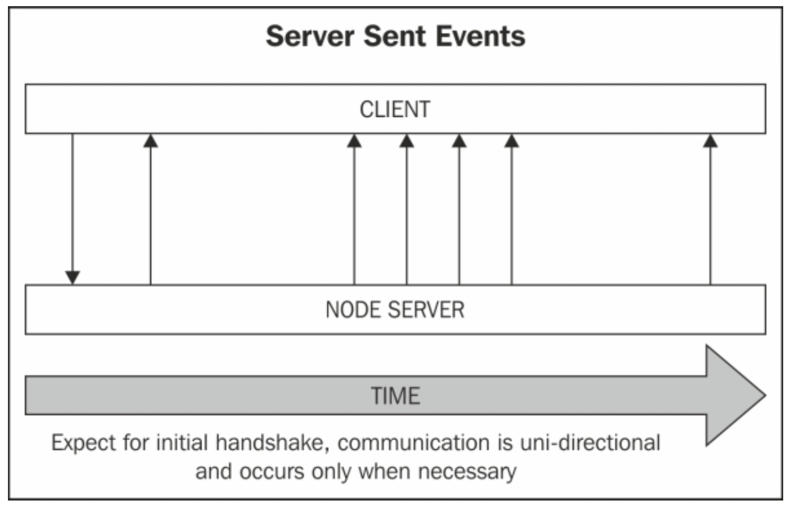

# Server Sent Event

## HTTP

웹에서 이루어지는 모든 데이터 교환은 *HTTP*라는 통신 프토토콜을 기초로 하는데, *HTTP*는 Request/Response 기반의 **무상태(Stateless) 프로토콜**이다. 무상태 프로토콜이란, 서버가 **별개의 두 요청 간에 그 어떠한 정보(State)도 유지하지 않는다**는 것을 의미한다.  

즉, 서버와 클라이언트 사이의 통신을 위한 영구적인 연결이 생성되지 않으며 사용자(Client)에서 Request를 전송하면 서버(Server)가 Response를 제공하는 **클라이언트-서버 모델**의 통신이 진행되며, 이를 **단방향 통신**이라고 한다.

*HTTP* 프로토콜은 오직 단방향 통신만을 지원하며, 그 어떠한 방법으로도 **양방향 통신은 수행할 수 없다.** 또한 **클라이언트-서버 모델**이므로 서버는 클라이언트에서 Request가 도착하기를 기다리다가 적절한 Response만 전달할 수 있으며, 클라이언트 측으로 먼저 Request를 전송할 수는 없다.

추가적으로 두 개의 요청 사이에 어떠한 상태도 저장하지 않기 때문에 **불특정 다수를 대상으로 하는 서비스에 적합**하지만, 클라이언트의 이전 상태를 전혀 알 수 없어 **복잡한 서비스를 제공하는데 문제가 발생**한다. 예를 들어, 방금 전에 로그인한 사용자의 로그 정보를 유지할 수 없다.

최근에는 소프트웨어가 *Saas(Software as a Service)*의 형태로 제공되기도 하고 있어 웹에서 제공하는 서비스의 복잡도가 점차 증가하고 있고, **클라이언트와 서버가 양방향 통신을 수행하는 것이 거의 기본적인 요구사항**이 되어가고 있다. 다행히도 과거부터 이러한 수요는 꾸준히 존재했고, 현재까지 많은 방법들이 제시되어 왔다.

*Web Socket*과 *Server Sent Event*에 대해 알아보기 이전에, 기존의 *HTTP* 프로토콜을 이용해 양방향 통신을 하는 것 처럼 느끼도록 하는 방법에 대해 알아본다. 

## Polling과 Long Polling

### Polling

*Polling*은 가장 무식하지만 구현이 간단하고 몇가지 장점도 존재하는 방식으로, 일정한 시간 간격을 두고 계속해서 서버로 Request를 전송한다. 

**일정한 시간 간격**으로 Request를 반복하여 전송하고 그에 대한 Response를 전달받는 것은 **장점**으로 작용할 수 있다. 특히, 그래프를 그리거나 대용량의 정보를 처리하는 경우 *Polling*은 유용하게 사용될 수 있는 방식이며 다른 방식에 비해 구현이 매우 간단한 최적화된 방식이다.

하지만, 양방향 통신의 가장 큰 목적 중 하나인 **실시간 통신**을 할 수 없다는 단점이 존재한다. 물론 **일정한 시간 간격**을 매우 짧게 설정해 실시간 통신을 하는 것 처럼 보일 수는 있겠지만, 엄청난 양의 Request를 서버로 전송하게 되므로 클라이언트의 수가 조금만 늘어나도 서버에 과부화가 걸리게 된다.

### Long Polling

*Long Polling*은 *Polling*의 단점인 **실시간성**을 개선한 방식으로, Request의 *Timeout* 기간을 굉장히 길게 설정하여 Response가 지금 당장 돌아오지 않더라도 계속해서 연결을 유지하게 된다. 서버로부터 Response가 도착하면 클라이언트는 즉시 Request를 재전송하고 다시 Response가 도착하기를 무한정 기다린다.

이와 같은 방법으로 *Long Polling*은 *Polling* 방식과 달리 마치 **실시간 통신이 이루어지는 것과 같은 느낌을 줄 수 있으며,** 따라서 채팅과 같은 실시간 서비스를 구현하는데 사용된다.

하지만 *Long Polling* 방식은 클라이언트와 서버 사이의 정보 전달이 매우 활발한 경우 지나치게 많은 Request와 Response가 발생한다는 점에서 단점도 존재한다. *Polling*은 주기적으로 한 번의 Request를 전달해 그동안 쌓인 데이터를 한번의 Response에 담아 가져올 수 있지만, *Long Polling*은 Response가 도착하는 즉시 다음 Request를 전송하므로 극히 소량의 데이터가 담긴 Request와 Response가 계속해서 교환되기 때문이다.

[참고] HTTP 프로토콜은 단발성 데이터 교환이므로 헤더의 크기가 크다. 따라서 Request와 Response의 수가 많아지면 서버에 부하가 걸린다.

## Server Sent Event(SSE)

*Polling*과 *Long Polling*은 무상태 프로토콜인 HTTP에서 실시간 데이터 교환을 '흉내'내기 위한 방법이었다. 하지만 기술의 발전에 따라 완전한 실시간 데이터 교환이 가능한 방법이 등장했는데, 그것이 *Web Socket*과 *Server Sent Event*이다.

두 가지 방식을 한 번에 다루기에는 그 양이 방대하므로, 오늘은 회사에서 진행하는 프로젝트에서 사용하는 SSE에 대해서만 작성하고 이후에 Web Socekt에 대해서 다시 작성하겠다.

### SSE 란?

SSE는 **서버의 데이터를 실시간으로, 지속적으로 Streaming할 수 있도록 해주는 기술**이다. SSE는 웹 표준으로써 Internet Explorer를 제외한 모든 브라우저에서 지원하고 있으며, *Polyfill*을 통해 IE에서 지원이 가능하다.

기존에는 서버에 새롭게 추가되거나 변경된 정보를 가져오려면 페이지를 새로고침 하거나 위에서 설명한 *Polling*을 사용해야 하는데, 회사에서 진행하는 프로젝트에서 요구되는 기능인 **푸시 알람**을 구현하기 위해서는 새로고침은 애초에 사용할 수 없었고 데이터가 주기적으로 도착하지 않기 때문에 *Polling* 방식도 적절하지 않은 상황이다.

추가적으로 클라이언트에서 서버로 데이터를 전송하는 일은 거의 존재하지 않고, 서버에 있는 정보를 읽어오는 것이 전부인 프로젝트이기 때문에 **양방향 통신**을 성립하는 *Web Socket*의 사용도 그다지 적절해 보이지 않았다.

반면 SSE는 기**존 HTTP 웹 서버에서 HTTP API만을 이용해 동작**하며, 그 구현도 간단하기 때문에 백엔드와 프론트엔드 양측 모두에서 쉽게 개발이 가능하다는 장점을 가지고 있어 채택하게 되었다.


### SSE 작동 방식

일반적으로 HTTP 프로토콜을 통한 정보 전송은 단발적으로 정보를 주고 받은 뒤 연결이 종료되는데, 파일 전송과 같이 대용량의 정보를 전송하는 경우에는 일정시간 연결 상태를 유지한다.

SSE는 파일 전송 과정처럼 연결이 처음 수립될 때 정보를 주고 받은 뒤, **연결을 종료하지 않고 유지하며 서버가 일방적으로 클라이언트에세 정보를 전달**할 수 있게 한다.




### SSE 구현하기

- Frontend (Vue.js)

  자바스크립트는 SSE를 손쉽게 구현할 수 있도록 하는 EventSource API를 기본적으로 내장하고 있으며, `new EventSource('서버 URL')`와 같이 생성자를 통해 새로운 EventSource 인스턴스를 만들어 사용할 수 있다.

  다음은 Vuex에서 EventSource API를 사용해 서버로부터 정보를 수신하고, 그 결과를 `state`에 저장하는 코드이다.

  ```
  const actions = {
    listenServerSentEvent: ({ commit }) => {
      const eventSource = new EventSource( "API Endpoint", { withCredentials: true }
      );

      eventSource.onmessage = event => {
        // 서버 측에서 JSON.stringify()를 사용해 전송하기 때문에, 파싱해주어야 한다.
        const notification = JSON.parse(event.data);

        commit("addNewEvent", notification);
      };
    }
  };
  ```

  EventSource 객체에는 기본적으로 세 가지의 *Event Handler*가 포함되어 있다.

  - `onerror`: 에러가 발생했을 때 호출된다.
  - `onopen`: 클라이언트-서버 간의 연결이 성립될 때 호출된다.
  - `onmessage`: 서버로부터 이벤트(정보)가 도착할 때 호출된다.

  ```
  eventSource.addEventListener("ping", function(event) {
    // 이벤트 처리 로직
  });
  ```

  이외에도 위와 같이 EventSource 인스턴스에 `addEventListener`를 추가하여 사용자 정의 이벤트를처리할 수도 있다. 위의 *Event Listener*는 서버에서 도착한 메세지의 `event` 필드가 `'ping'`으로설정되어 있는 경우 호출된다.

  마지막으로, EventSource 객체의 `close()` 메서드를 사용해 연결을 종료할 수 있다.

  [불확실] 클라이언트-서버 간 연결이 종료되는 약 3초 이후 다시 연결이 이루어지며, 서버측에서 메세지의 `retry ` 필드를 수정해 연결 종료 후 재연결까지의 시간을 설정할 수 있다. 

- Backend (Express)

  SSE는 기존의 웹 서버 통신 방식인 HTTP 프로토콜을 그대로 사용하므로, **별도의 설정 없이 클라이언트에 Response를 전달하는 로직에서 SSE를 사용하겠다는 헤더를 설정**하고 정보를 전송하면 된다. 여기서 주의할 점은, SSE를 통한 정보 전송 시 *Event Stream Format*에 따라 전송해야 한다는 것이다.

  *Event Stream Format*은 다음과 같다.
  - Content-Type을 `text/event-stream`으로 설정한다.
  - `UTF-8` 인코딩의 일반 텍스트 데이터만 전송 가능하다.
  - 각각의 메세지는 `event`, `data`, `id`, `retry`와 같은 필드 이름을 가지며, `:`를 사용해 필드 값과 구분한다.
  - 각각의 데이터는 두 개의 개행문자 `\n\n`을 사용해 구분하며, 단일 데이터에서 메세지 분할을 하는 경우 `\n`을 사용한다.

  다음은 *Express* 서버에서 SSE를 사용하는 코드이다.

  ```
  exports.emitEvents = (req, res, next) => {
    // 배열 형태의 임시 데이터베이스
    const { eventPool } = TEMP_DATA;   

    // SSE 사용을 위한 헤더 설정
    res.set({
      'Cache-Control': 'no-cache',
      'Content-Type': 'text/event-stream',
      'Connection': 'keep-alive'
    });
    res.flushHeaders();

    // SetInterval을 사용한 이벤트 발생
    const emissionInterval = setInterval(() => {
      if (eventPool.length === 0) {
        clearInterval(emissionInterval);
        res.end(); // terminates SSE session
        return;
      }

      const event = eventPool.pop();

      // SSE 데이터 작성
      res.write(`data: ${JSON.stringify(event)} \n\n`); 
    }, 3000);

    // 사용자가 연결을 종료하면, 이벤트 전송을 중단한다.
    res.on('close', () => {
        console.log('[INFO] Disconnected to Client');

        clearInterval(emissionInterval);
        res.end();
        return;
    });
  }
  ```

  위 코드에서는 `JSON.stringify()` 메서드를 사용해 자바스크립트 객체를 문자열로 변경해 `data` 필드에 추가한 뒤 클라이언트로 전달하고 있다. 다음과 같이 `event` 필드에 값을 추가해 특정한 *Topic*을 설정하고 *Topic* 기반의 데이터 구독도 가능하다.

  **Frontend**
  ```
  eventSource.addEventListener('notification', event => { 
    const data = JSON.parse(event.data); 
    console.log(`Notification Received`); 
  });
  ```

  **Backend**
  ```
  res.write("event: notification \n");  // Topic 지정
  res.write(`data: ${JSON.stringify(event)} \n\n`); 
  ```

## 결론

*SSE*와 *Web Socket*은 *Polling*, *Long Polling* 방식에 비해 최신 기술인 것은 맞지만, 반드시 모든 상황에서 우위를 가지는 것은 아니라고 한다. 각각의 상황에서 적절한 방식을 선택해 사용할 수 있는 능력을 기르는 것이 보다 좋은 개발자가 되기 위한 필수조건일 것이다. 다음에는 Web Socket에 대해 알아보고 간단한 예제도 구현해볼 수 있다면 좋겠다.