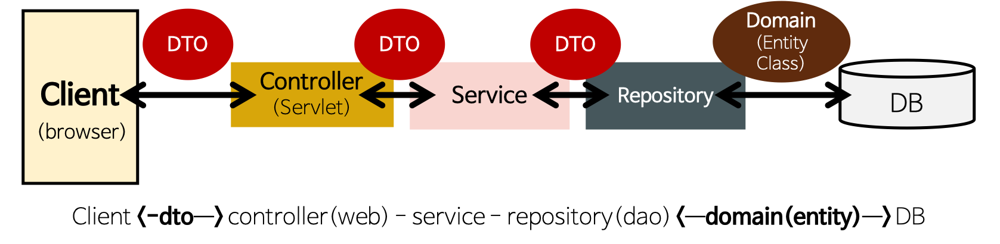

# DAO, DTO

MVC Pattern을 세분화하면 다음과 같은 5개의 Layer로 구분된다.

- Presentation Layer - 사용자 인터페이스
- Control Layer - Presentation Layer와 Business Layer 분리
- Business Logic Layer - 핵심 업무에 대한 처리
- **Persistence Layer** - 데이터 처리(C, R, U, D...) 담당 
- Domain Model Layer - 각 계층 사이에 전달되는 실질적인 데이터 객체

## DAO(Data Access Object)

**Repository Package**

- Database에 실제적으로 접근하는 객체이다.
- Service와 Database를 연결하는 고리의 역할을 수행한다.
- SQL Query를 작성해 Database에 접근하고 적절한 CRUD API를 제공한다.
    - JPA를 사용하여, JPQL Query를 사용할 수도 있다.
    - 또는 Spring Data JPA(`extends JpaRepository<T, T>`)를 사용하여, 기본 CRUD 기능을 제공받는다.

```
public interface QuestionRepository extends JpaRepository<Question, Long> {
    ...
}
```

## DTO(Data Transfer Object)

**DTO Package**

- 계층 간 데이터 교환(Data Transfer)을 위한 객체(Java Bean)이다.
    - Database에서 데이터를 얻어 Service나 Controller 계층으로 전달할 때 사용된다.
    - 로직을 갖고 있지 않는 순수한 데이터 객체이며, Getter/**Setter** 메서드만 갖는다.

- Request와 Response용 DTO는 View를 위한 클래스이다.
    - 요구 변경에 따라 **자주 변경이 필요**하다.
    - `toEntity()` 메서드를 통해 *DTO 클래스*에서 필요한 부분만을 이용해 Entity로 만든다.
    - 또한, Controller 계층에서 Response DTO 형태로 Client에 전달한다.

DTO의 간략한 예시는 다음과 같다.  

```
@Getter
@NoArgsConstructor
@AllArgsConstructor
public class UserDto {
    @NotBlank
    @Pattern(regexp = "^([\\w-]+(?:\\.[\\w-]+)*)@((?:[\\w-]+\\.)*\\w[\\w-]{0,66})\\.([a-z]{2,6}(?:\\.[a-z]{2})?)$")
    private String email;

    @JsonIgnore
    @NotBlank
    @Size(min = 4, max = 15)
    private String password;

    @NotBlank
    @Size(min = 6, max = 10)
    private String name;

    public User toEntity() {
        return new User(email, password, name);
    }

    public User toEntityWithPasswordEncode(PasswordEncoder bCryptPasswordEncoder) {
        return new User(email, bCryptPasswordEncoder.encode(password), name);
    }
}
```

**참고** - VO(Value Object) vs. DTO  
VO는 DTO와 거의 동일한 개념이지만, **read only 속성**을 갖는다.


## Entity 클래스

**Domain Package**

- 실제 Database의 테이블과 매칭되는 클래스이다.
    - 따라서 가장 Core한 클래스이며, *Entity 클래스*라고 한다.
    - `@Entity`, `@Id`, `@Column` 등의 Annotation을 이용한다.

- 외부에서 Entity 클래스의 Getter 메서드를 사용하지 않도록 해당 클래스 안에서 필요한 로직 메서드를 구현한다.
    - Domain Logic만 가지고 있어야 하고 Presentation Logic을 가지고 있어서는 안된다.
    - 여기서 구현한 method는 주로 Service Layer에서 사용한다.

**[참고]** Entity 클래스와 DTO 클래스를 분리하는 이유

1. View Layer와 DB Layer의 역할을 철저하게 분리하기 위해서이다.
2. *Entity 클래스*가 변경되면 여러 클래스에 영향을 끼치게 되는 반면 View와 통신하는 *DTO 클래스*(Request / Response 클래스)는 자주 변경된다.
3. Domain Model을 복잡하게 조합한 형태의 Presentation 요구사항들이 있기 때문에 Domain Model을 직접 사용하는 것은 어렵다.

즉 **DTO는 Domain Model을 복사한 형태**로, 다양한 Presentation Logic을 추가한 정도로 사용하며 Domain Model 객체는 Persistent만을 위해서 사용한다.

```
@Entity
@Getter
@AllArgsConstructor
@NoArgsConstructor
@EqualsAndHashCode
@ToString
public class User implements Serializable {
    private static final long serialVersionUID = 7342736640368461848L;

    @Id
    @GeneratedValue(strategy = GenerationType.IDENTITY)
    @JsonProperty
    private Long id;

    @Column(nullable = false)
    @JsonProperty
    private String email;

    @Column(nullable = false)
    @JsonIgnore
    private String password;
}
```

## 전체 Package 구조 



#### Controller
- 기능
    - 각 Request URL에 따라 적절한 View를 Mapping한다.
    - `@Autowired Service`를 통해 Service의 메서드를 이용한다.
    - 적절한 ResponseEntity(DTO)를 Response Body에 담아 Client에게 반환한다.

```
@RestController
@RequestMapping("/api/users")
public class ApiUserController {
  @Autowired
  private UserService userService;

  @PostMapping("/login")
  public ResponseEntity login(@RequestBody @Valid LoginDto loginDto, HttpSession session) {
      SessionUtil.setUser(session, userService.login(loginDto));
      return new ResponseEntity(HttpStatus.OK);
  }
}
```

#### Service
- 기능
    - `@Autowired Repository`를 통해 Repository의 메서드를 이용한다.
    - 적절한 비즈니스 로직을 처리한다.
    - DAO로 Database에 접근하고 DTO로 데이터를 전달받은 다음, 비즈니스 로직을 처리해 적절한 데이터를 반환한다.

```
@Service
public class UserService {
  @Autowired
  private UserRepository userRepository;

  @Resource(name = "bCryptPasswordEncoder")
  private PasswordEncoder bCryptPasswordEncoder;
  
  @Autowired
  private MessageSourceAccessor msa;

  public User save(UserDto userDto) {
      if (isExistUser(userDto.getEmail())) {
          throw new UserDuplicatedException(msa.getMessage("email.duplicate.message"));
      }
      return userRepository.save(userDto.toEntityWithPasswordEncode(bCryptPasswordEncoder);
  }
}
```