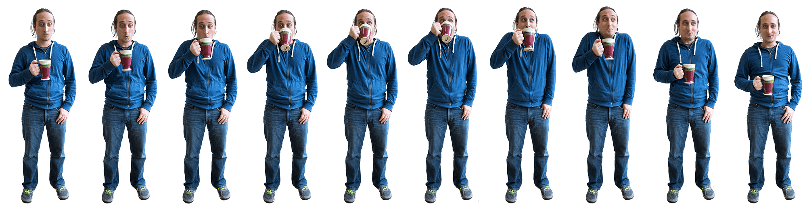

# CSS Animation

CSS를 사용해 Animation을 구현하는 방법에는 `transition` 속성을 이용하는 방법과 
`animation` 속성을 사용하는 방법이 존재한다.

`animation`과 `transition`의 가장 중요한 차이점은 ***Key Frame*을 지정할 수 있다**는 것인데,  
*Key Frame*은 특정 물체가 변형되는 도중에 진행 방향을 변경하는 등 **'변화'가 발생하는 위치**를 말한다.

`animation` 속성을 사용하기 위해 ***Timeline*** 개념에 대해서도 알고 있어야 한다.
어떠한 물체가 A 지점에서 B 지점으로 이동하는 경우 A 지점이 0%, B 지점은 100%가 된다.

```
@keyframes sample-animation {
    0% {
        transform: translate(0, 0);
    }
    50% {
        transform: translate(500px, 0);
    }
    100% {
        transform: translate(700px, 500px);
    }
}

.box {
    animation: sample-animation 2s linear;
}
```

`@keyframes`로 작성한 Animation을 HTML 태그에 적용하려면 대상의 CSS 속성에  
`animation: name duration timing-function delay iteration-count direction fill-mode play-state;`와 같이 추가한다.

- `iteration-count`
    - Animation의 반복 재생 횟수를 지정한다.
    - Animation을 무한히 반복하고 싶은 경우, `infinite` 속성을 사용한다.
- `direction`
    - Animation이 진행되는 방향을 지정한다.
    - Animation의 시작, 종료지점을 반대로 설정하고 싶은 경우, `reverse` 속성을 사용한다.
    - Animation의 시작과 종료지점을 동일하게 설정하고 싶은 경우, `alternate` 속성을 사용한다.
- `fill-mode`
    - Animation이 종료된 후의 상태를 지정한다.
    - Animation 종료 후, 대상을 종료지점에 고정하고 싶은 경우, `forwards` 속성을 사용한다.
- `play-state`
    - Animation의 재생 상태를 지정한다.
    - Animation을 일시정지하고 싶은 경우, `paused` 속성을 사용한다.

```
.box {
    animation: sample-animation 2s linear;
}
.box:hover {
    animation-play-state: paused;
}
```


## Frame by Frame Animation

*Frame by Frame Animation*이란, 개별적으로 그려진 장면들을 연결하여 Animation으로 만드는 것을 말한다.  
CSS의 `animation`으로 *Frame by Frame Animation*을 구현하려면 **Image Sprite**가 필요하다.

**Image Sprite**



위의 그림과 같이 여러 장의 이미지를 연결해 놓은 것을 **Image Sprite**라고 부르며,  
`animation` 속성을 이용해 전체 이미지를 구성하고 있는 단일 이미지를 *Frame*으로 사용하게 된다.  
(이미지는 전체 해상도 2000 x 509이며, 총 10개의 200 x 509 크기를 가지는 단일 이미지로 구성되어 있다.)

```
@keyframes drinkCoffee {
    /* 시작 위치 생략 가능*/

    to {
        background-position: -2000px 0;
    }
}

.runner {
    width: 200px;
    height: 509px;
    background: url('./sprite.png') no-repeat 0 0 / auto 509px
    animation: drinkCoffee 1s infinite steps(10);
}
```

*Frame by Frame Animation*을 구현한 CSS Style Sheet이다. 먼저 `@keyframes`로 Animation을 만드는데,  
`background: url('./sprite.png') no-repeat 0 0 / auto 509px`에서 시작점 (0, 0)이 정의되어 있어 생략 가능하다.

다음으로 `animation: drinkCoffee 1s infinite steps(10);` 속성을 추가하여 Animation을 등록한다.  
여기서 전체 *Sprite Image*를 구성하고 있는 단일 이미지의 개수에 맞추어 `steps(10)` 속성을 설정해주면 된다. 


## Why not GIF?

GIF 포맷의 파일을 사용하면 Animation을 구현하기 굉장히 쉽고 편리하지만,  
투명도를 나타내는 ***Alpha Channel*이 존재하지 않는다는 치명적인 단점**을 가지고 있다.

*Sprite Image*를 통한 Animation은 *Alpha Channel*을 지원하는 PNG 파일을 사용할 수 있어 고해상도 지원이 가능하고,  
Animation을 코드로 제어하기 때문에 **자유자재로 변형**할 수 있다는 장점도 존재한다.