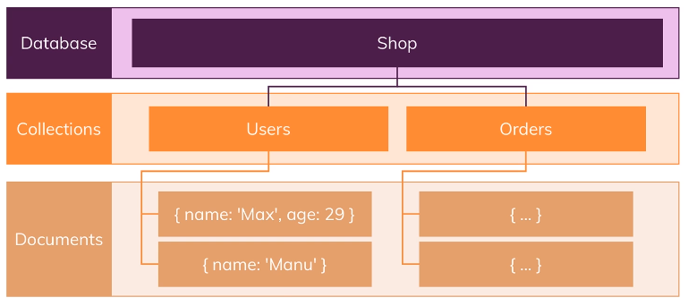
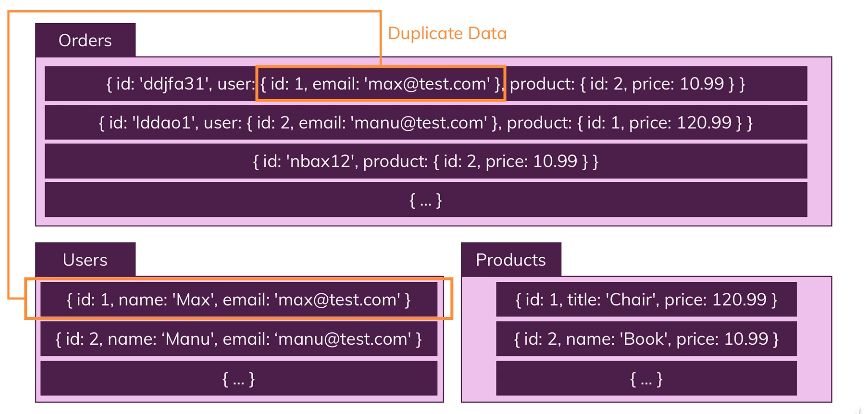
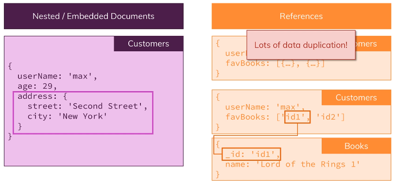

# NoSQL Basic


## NoSQL(MongoDB) Introduction

MongoDB는 NoSQL 방식의 데이터베이스이며, *Database*, *Collection*, 그리고 *Document*로 구성된다.  
각각은 SQL 방식의 데이터베이스에서 사용하는 개념인 *Database*, *Table*, *Record*에 상응한다.  



NoSQL 방식의 데이터베이스와 기존의 SQL 방식의 데이터베이스의 **가장 큰 차이점은 *Schemaless*한 특징**이라고 할 수 있다.  

***Schema*란 데이터베이스에 저장된 데이터가 공통적으로 가지는 구조**를 말하며, 따라서 *Schemaless*하다는 것은  
동일한 *Document*에 저장된 데이터라 하더라도 서로 다른 구조를 가질 수 있다는 것을 말한다.

반대로 *Schematic*한 SQL 방식의 데이터베이스에 저장되는 모든 데이터는 사전에 정의된 특정한 구조를 따르며,  
동일한 구조의 데이터 집합을 *Table*, 데이터 집합에 포함된 단일 항목을 *Record*, 각 항목을 구성하는 내용을 *Field*라고 한다.

하지만 그렇다고 해서 **동일한 성질의 데이터 집합인 *Document*에 무작위적으로 데이터를 저장하는 것은 바람직하지 않고**  
정상적으로 데이터베이스를 운영하기 위해서는 데이터가 적어도 비슷한 구조를 가지도록 관리하는 것이 필요하다.


#### NoSQL 방식의 장점

엄격하게 데이터의 구조를 제한하는 SQL 방식에 비해 데이터의 구조에 대한 자유가 보장되기 때문에,  
서비스의 규모를 확장하기 위해 데이터 구조를 변경하는 것이 굉장히 쉽고 편리하다.

반면 기존의 SQL 방식의 데이터베이스를 사용하는 경우, *Table*에서 하나의 *Column*을 추가하는 것도 굉장히 복잡하다.


## BSON

MongoDB는 데이터, 즉 *Document*를 *Collection*에 저장하기 위해 *JSON*과 유사한 *BSON*을 사용하며, 다음과 같이 표현된다.  

```
{
    "name": "Junyoung",
    "age": "26",
    "address": {
        "city": "Seoul"
    },
    "hobbies": [
        { "name": "Game" },
        { "name": "Taking Pictures" }
    ]
}
```

위의 예시에서, 각 *Field*는 일반적인 *JSON* 형식의 데이터와 동일하게 { key: value } 형식으로 나타내어 진다.  
이때, `address`와 `hobbies`과 같이 **value에 또 다른 *Document*를 가지는 것을 *Embedded Document***라고 하며,  
NoSQL 방식의 데이터베이스를 이해하고 활용하기 위해서 필수적으로 알아야하는 개념 중 하나이다.


## Relations

SQL 방식의 데이터베이스를 다른 말로 **관계형 데이터베이스**라고 부르기도 하는데, 이는 데이터를 **관계**로 표현하기 때문이다.  
관계형 데이터베이스는 단일 또는 다수의 *Table*로 구성되며, *Table*은 *Row*와 *Column*으로 이루어져 있다.


*Table*의 단일 데이터를 의미하는 *Row*를 ***Tuple*** 또는 *Record*라고 부르기도 하며,  
고유한 이름으로 *Row*의 구조를 정의하는 *Column*은 ***Attribute*** 또는 *Field*라고 불리기도 한다.

특정한 조건을 만족하는 *Table*을 *Relation*이라고 부르는데, 그러한 조건은 다음과 같다.

- *Attribute*는 원자적인 값을 갖는다.
- *Attribute*는 중복된 이름을 갖지 않는다.
- *Attribute*의 순서는 상관없다.
- 중복된 *Tuple*은 허용되지 않는다.
- *Tuple*의 순서는 상관없다,

서로 다른 **데이터에 종속성이 존재하는 경우, *Foreign Key*라는 것을 사용해 이러한 연관 관계를 표현**한다.
*Table* 또는 *Relation* 사이의 관계는 관계에 포함되는 *Table* 또는 *Relation*의 개수에 따라 다음과 같이 나눌 수 있다.

- 일대일 관계
- 일대다 관계
- 다대다 관계


## Relations in NoSQL

NoSQL 방식의 데이터베이스에서 서로 다른 두 데이터의 관계, 즉 *Relation*을 정의하는 것은 기존의 SQL 방식과 매우 다르다.  




위의 그림에서 사용자에 대한 정보를 저장하는 *User Collection*에 저장되어 있는 *Document*의 일부가  
주문 정보를 저장하는 *Order Collection*에서 *Embedded Document*의 형태로 사용되고 있는 것을 확인할 수 있다.

이는 *User Collection*과 *Order Collection* 사이에 **데이터 종속성이 발생**한 것인데, NoSQL 방식의 데이터베이스에서는  
관계형 데이터베이스에서 **데이터의 ID를 사용해 데이터를 참조하는 방식을 사용하지 않고 *Embedded Document*의 형태로 데이터를 직접 추가**해버린다.

따라서, 다수의 데이터가 연관되어 있는 상황에서 **서로 다른 *Collection*을 참조해 데이터를 색인하는 과정이 생략되어 처리 속도가 개선**된다.

*Embedded Document*를 이용해 *Relation*을 표현하는 방법은 **데이터를 저장하고 읽어오는 과정에서는 굉장히 효율적**일 수 있지만, 
**데이터를 수정하는 과정에서는 매우 비효율적**이다. 예를 들어 사용자의 전화번호가 변경될 때, 해당 사용자의 정보가 포함된 주문 정보를 모두 색인하여 값을 변경해야 한다.



다량의 데이터가 계속해서 추가되기만 하고 수정 요구는 비교적 적은 서비스에서는 *Embedded Document* 방식이 유리하지만,  
데이터의 추가는 적지만 수정 소요가 굉장히 잦은 서비스에서 *Embedded Documents*를 이용한 *Relation*의 표현은 비효율적이다.

따라서 기존의 관계형 데이터베이스에서 사용하는 방법과 같이, 데이터 종속성이 존재하는 *Collection*에 대한 ***Reference*를 저장**하여  
**데이터를 읽는 과정은 보다 복잡해지지만, 수정하는 과정에서의 편리성을 취하는 방법**을 택해야 한다.


