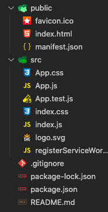

# React.js 시작하기

Vue.js를 사용해 지금까지의 모든 웹 프론트 프로젝트를 진행해 왔지만, 대부분의 채용공고에서 React.js를 요구하고 있는 상황이라 React.js에 대한 공부가 필요하다고 생각되어 Udemy에서 강의를 하나 구매했다.


## `create-react-app` 이란?

Vue.js 프로젝트를 시작할 때, Scratch부터 프로젝트 개발 환경을 구성해도 되지만 **편의성**을 위해 Vue CLI를 사용하였다. React.js 프로젝트 역시 **초기 설정 및 파일 구조 정의를 손쉽게 진행할 수 있는 NPM 패키지**를 제공하며, `npm install creat-react-app -g` 명령어를 통해 전역 설치하여 사용할 수 있다.  

만약 전역으로 설치하지 않고 필요할 때만 사용하고 싶은 경우, NPX를 사용해 `npx create-react-app` 명령어를 실행하면 신규 React.js 프로젝트를 손쉽게 시작할 수 있다.

```
npx create-react-app <프로젝트 명> <--옵션>
```

```
npx create-react-app udemy-course --scripts-version 1.1.5
```

[참고] `--scripts-version 1.1.5` 옵션을 사용해 **실질적으로 React.js 프로젝트를 구성하고 생성**하는 `react-scripts` 패키지의 1.1.5 버전을 사용하도록 설정할 수 있다. **`react-script` 패키지의 버전을 설정하는 것이지 React.js의 버전을 설정하는 것이 아니라는 것을 기억하자!**

<br>

## Development Server(= 개발 서버) 동작시키기

`create-react-app` 패키지를 사용해 프로젝트를 생성하면, `package.json` 파일에 기본적으로 4-5개의 NPM 명령어가 설정되어 있다. 이들 중 `npm start` 명령어를 사용하면 **개발 서버**를 사용할 수 있으며, *Hot-Reloading*과 같은 기능을 내장하고 있어 편리한 개발 환경을 제공해준다.

[참고] React.js의 개발 서버는 기본적으로 3000번 포트를 사용하며, `http://localhost:3000`에서 확인할 수 있다.

<br>

## React.js의 폴더 구조

`npx create-react-app udemy-course --scripts-version 1.1.5` 명령어를 사용해 생성한 React.js 프로젝트의 초기 폴더 구조는 아래의 그림과 같다.  





- `public`
  - `favicon.ico` : 기본적으로 제공되는 React App의 Favicon 이미지
  - `index.html` : 모든 React Components가 렌더링되는 단일 HTML 파일 (= SPA).
  - `manifest.json` : 기본적으로 제공되는 PWA 정의 파일
- `src`
  - `index.js` : `index.html`의 `root` ID를 가지는 DOM에 접근해 *Root Component*(= `App.js`)를 주입
  - `App.js` :  생성된 React App에 존재하는 유일한 *React Component*이자 *Root Component*
  - `registerServiceWorker.js` : 기본적으로 제공되는 PWA 서비스워커
- `package.json`
  - 각종 패키지 의존성, 프로젝트의 정보를 설정할 수 있는 파일

<br>

## Component 기초

Vue.js 프로젝트와 같이, React.js 프로젝트도 **모든 웹 페이지를 독립적으로 최소 단위 기능을 수행하는 *Component*를 이용해 구성**한다. 즉, 사용자가 보는 화면은 하나 또는 다수 개의 *Component*로 구성되며 개발자는 이러한 *Component*의 재사용성을 극대회할 수 있는 방향으로 코드를 작성해야 한다.

<br>

### *Root Component*

Vue.js 프로젝트에서와 같이 화면을 구성하는 모든 *Component*는 **프로젝트 전역에 단 하나만 존재하는 *Root Component*의 하위 *Component*로 구성**되도록 해야 한다.

주로 이러한 *Root Component*의 이름은 `App`으로 설정하며, 기본적으로 생성된 React.js 프로젝트의 `src/index.js`에서도 `App`이라는 이름을 가지는 *Component*를 렌더링하고 있다.

```
// src/index.js

import React from 'react';
import ReactDOM from 'react-dom';
import './index.css';
import App from './App';

ReactDOM.render(<App />, document.getElementById('root'));
```

이후 화면을 구성하기 위해 필요한 하위 *Component*는 **프로젝트의 *Root Component*로 등록된 `App`이라는 *Component*의 내부에 중첩(= Nested)하여 등록**하면 된다.

<br>

### *Component* 만들기

*React Component*를 만드는 방법에는 크게 두 가지가 있는데, 하나는 **`class`를 이용하는 *Class-Based Component***로 작성하는 방법과 **`function`을 이용하는 *Functional Component***로 작성하는 방법이다.

*Functional Component*는 비교적 새로운 기능이며, 이를 지원하기 위한 다양한 추가 기능들이 소개되고 있다. *Class-Based Component*는 초창기의 React.js에서 사용해온 방식으로, 현재 React.js로 작성되어 시장에서 사용되고 있는 프로젝트는 *Class-Based Component*를 사용하고 있을 가능성이 크다.


```
// Class-Based Component
import React, { Component } from 'react';
import './App.css';

class App extends Component {
  render() {
    return (
      <div className="App">
        <p className="App-intro">
          To get started, edit <code>src/App.js</code> and save to reload.
        </p>
      </div>
    );
  }
}

export default App;
```

위의 코드는 *Class-Based Component*의 예시로서, `react` 패키지의 `Component`를 상속받는 형태로 작성되어 있다. *Class-Based Component*는 반드시 클래스 내부에 **`JSX`로 작성된 내용을 `return`하는 `render()` 메서드가 존재**해야 한다.