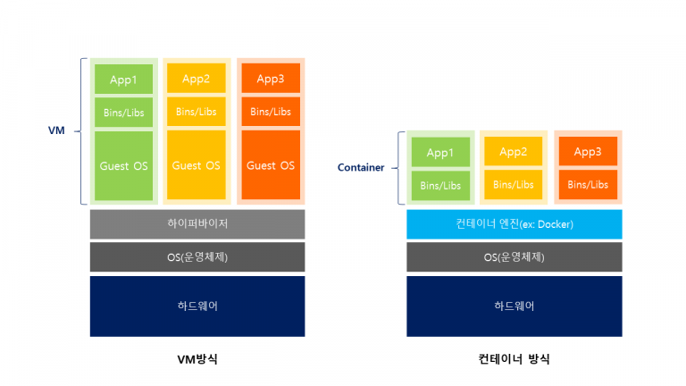
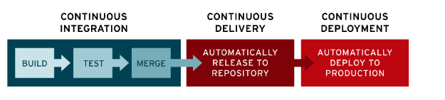

# 클라우드 네이티브

클라우드 네이티브는 **처음부터 클라우드 환경에서 운영할 것을 전제**로, 소프트웨어를 설계하는 것을 말한다. 

처음부터 클라우드 환경에서의 사용을 염두에 두었기 때문에, 클라우드 네이티브 어플리케이션은 **클라우드 환경에서 얻을 수 있는 장점을 극대화**할 수 있다.

> 클라우드 네이티브 어플리케이션은 개발사 자체 데이터센터에 배포되지 않고, AWS 등의 퍼블릭 클라우드(Public Cloud)에 배포된다.

클라우드 네이티브를 이루는 네 가지 주요 기술은 다음과 같다.

- 컨테이너
- 마이크로서비스
- CI/CD
- DevOps

## 컨테이너 (Container)

가상화 기술 중 하나로, 시스템을 가상화하는 것이 아니라 **어플리케이션 실행 환경을 가상화** 하는 것이다. 

- 기존의 하이버파이저 기반 가상화 기술은 Host OS 위에서 Guest OS가 동작한다.
    - Guest OS를 부팅한 뒤, 어플리케이션을 실행하여 속도가 느리다.
- 컨테이너 기반의 가상화는 별도의 OS를 필요로 하지 않는다.
    - OS를 부팅하는 과정이 생략되어, 더 가볍고 크기가 작아 복제와 배포가 간편하다.
- Docker는 대표적인 컨테이너 엔진이다. 

 

## 마이크로서비스 아키텍처

어플리케이션을 이루는 서비스들을 **기능 단위로 분리하여 구축**하는 것을 말한다.

마이크로서비스 아키텍처는 기존의 모놀리식 아키텍처에 비해 다음과 같은 장점을 갖는다. 

- 부분 장애가 발생해도 전체 서비스에 영향을 미치지 않는다.
- 빌드와 테스트에 필요한 시간이 감소한다.
- 기능 별 부분적인 확장이 가능하다.
- 기능 별 상이한 기술 스택을 채택할 수 있다.

 

## DevOps

DevOps는 IT 서비스의 개발과 운영 프로세스를 통합하여 **고객에게 뛰어난 품질의 서비스를 빠르게 제공**하기 위한 조직 문화이다. 

과거에는 새로운 서비스를 출시하기 위해서 오랜 기간 작업했지만, 현재는 서비스 출시 속도가 빠르고 업데이트 주기 또한 빈번해졌다.

따라서, 개발된 소프트웨어가 시스템의 안정성을 유지하면서 사용자에게 빠르게 제공될 수 있도록 [개발 - 테스트 - 배포 - 운영]의 업무 사이클을 자동화해야 한다.

- `Dev`는 개발자를 의미하며, 계속해서 새로운 것을 도입하고자 한다.
- `Ops`는 운영자를 의미하며, 안정성을 최우선 가치로 여긴다.
- `DevOps`는 두 주체를 융합하여, 의사소통이 원활하게 되도록 하는 개발 방법론이다.

 

## CI/CD

CI/CD는 어플리케이션의 개발 단계를 자동화하여, **짧은 주기로 고객에게 개선된 어플리케이션을 제공**하는 방법이다.

- CI (Continous Integration)
    - 지속적인 통합을 의미한다.
    - 어플리케이션의 **빌드, 테스트 과정을 자동화**하는 것이다.
    - 코드 변경 사항이 정기적으로 빌드, 테스트 되어 **공유 레포지토리에 반영**된다.

- CD (Continous Deployment or Continous Delivery)
    - 지속적인 배포를 의미한다.
    - 어플리케이션의 **배포, 릴리즈 과정을 자동화**하는 것이다.
    - 레포지토리에 반영된 변경 사항이 정기적으로 **실시간 프로덕션 환경으로 배포**된다.

- 대표적인 CI/CD 도구는 `Jenkins`와 `Travis CI`가 있다.
