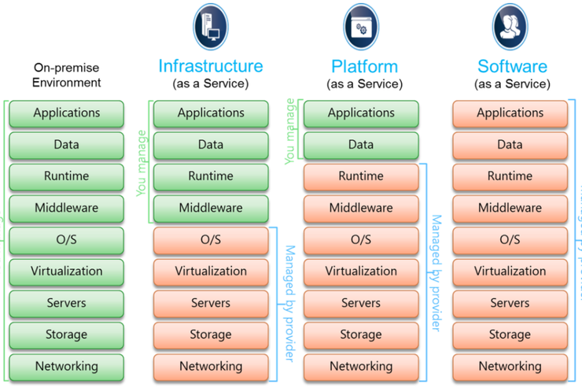

# 클라우스 서비스 종류

클라우드 컴퓨팅은 **인터넷으로 가상화된 IT 리소스를 서비스로 제공하는 것**을 의미한다. 클라우드 컴퓨팅을 통해 가상화되어 제공되는 대상은 대표적으로 서버, 플랫폼, 소프트웨어이다.

클라우드 서비스의 종류는 크게 아래의 세가지로 나누어진다.

- IaaS는 개발사에 제공되는 **물리적 자원**을 가상화한다.
    - 확장성이 높고 자동화된 컴퓨팅 리소스를 가상화하여 제공하는 것이다.
- PaaS는 개발사에 제공되는 **플랫폼**을 가상화한다.
    - 응용 프로그램을 개발할 때 필요한 플랫폼을 가상화하여 제공하는 것이다.
- SaaS는 고객에게 제공되는 **소프트웨어**를 가상화한다.
    - 사용자에게 제공되는 소프트웨어를 가상화하여 제공하는 것이다.

> 서비스(Service)란, 사용자가 **소비하는 형태로 제공**하는 것을 말한다.

 

## IaaS (Infrastructure as a Service)

IaaS는 고객에게 서버, 네트워크 OS, 저장장소를 가상화하여 제공하고 관리한다.

- 가상화된 물리적 자산(CPU, RAM 등)을 대시보드 UI 또는 API로 제공한다. 
- 물리적 자산을 가상화하여 제공하기 때문에, **손쉽게 사양을 변경**할 수 있다.

IaaS는 **필요에 따라 확장 또는 축소할 수 있는 유연성**이 있으므로, 새로운 응용 프로그램에 어떤 요구가 필요한지 확실하지 않을 때 도움이 된다.

IaaS의 대표적인 예시는 다음과 같다.

- Amazon Web Service(AWS)
- Microsoft Azure
- Google Compute Engine(GCE)

 

## PaaS (Platform as a Service)

PaaS는 고객에게 OS, 미들웨어, 런타임 등의 **소프트웨어 작성을 위한 플랫폼**을 가상화하여 제공하고 관리한다. 

- 웹을 통해 제공되며 운영체제, 소프트웨어 업데이트, 저장소를 관리하지 않아도 된다.
- 따라서, 개발자는 **소프트웨어 개발에 집중**할 수 있다.

동일 프로젝트를 수행하는 여러 개발자가 있는 경우, 전체 프로세스에 뛰어난 속도와 유연성을 제공할 수 있다. 또한, 어플리케이션을 빠르게 개발하고 배포하는 과정에서 발생하는 문제를 단순화할 수 있다.

PaaS의 대표적인 예시는 다음과 같다.

- Heroku
- Netlify

 

## SaaS (Software as a Service)

SaaS는 고객을 대신해 소프트웨어와 데이터를 제공하고 관리한다.

- 클라이언트의 컴퓨터에 응용 프로그램을 다운로드하고 설치할 필요가 없다.
- 고객은 유지보수 및 자원을 간소화하고, **비즈니스에 집중**할 수 있다.

특정 기기에 설치하여 사용하는 소프트웨어는 모바일에서 접근할 수 없기 때문에, SaaS를 사용하면 비용과 시간을 절약할 수 있다.

SaaS의 대표적인 예시는 다음과 같다.

- Dropbox
- Apple iCloud
- Google Drive
